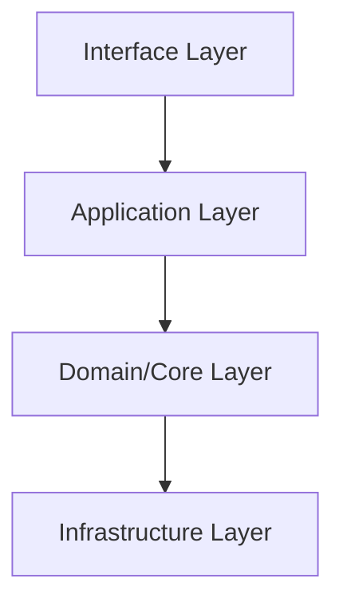

# Output Formats

## 1. Daily Brief (`briefs/daily/YYYY-MM-DD.md`)

```md
---
type: github_trending_brief
date: YYYY-MM-DD
source: https://github.com/trending
scope: daily
item_count: 20
---

# GitHub Trending Brief (YYYY-MM-DD)

## Top Highlights
- owner/repo: one-line insight

## Trend Table
| Rank | Repo | Language | Stars | Stars Today | Why It Matters |
|---|---|---|---:|---:|---|

## Candidate Actions
- Add to watchlist: owner/repo (reason)
```

## 2. Project Profile (`projects/<owner>__<repo>/profile.md`)

```md
---
type: github_project_profile
repo: owner/repo
analyzed_at: YYYY-MM-DDTHH:MM:SSZ
source: gh|git_fallback
---

# owner/repo Dossier

## Summary
- Description
- Data source

## Baseline Metrics
- Stars/Forks/Open issues/Watchers/Last pushed

## Codebase Signals
- Top directories
- Technology hints
```

## 3. Update Digest (`projects/<owner>__<repo>/updates/YYYY-MM-DD.md`)

```md
---
type: github_project_update
repo: owner/repo
generated_at: YYYY-MM-DDTHH:MM:SSZ
source: gh|git_fallback
---

# Update Digest: owner/repo

## Metric Changes
- stars: old -> new (+delta)

## Commit Signals
- latest_commit: old -> new

## Why It Matters
- one-line impact note
```

## 4. Deep Analysis (`projects/<owner>__<repo>/updates/YYYY-MM-DD-deep-analysis.md`)

```md
# Deep Analysis: owner/repo

## 分层架构图


## 代码目录结构图
```text
repo/
├── src/
├── docs/
└── ...
```

## 项目定位与技术路径
- ...

## 架构分层
- ...

## 功能模块拆解
- ...

## 核心配置与工程化
- ...

## 集成与部署方式
- ...

## 主要优势与风险
- ...

## 结论与建议
- ...
```
