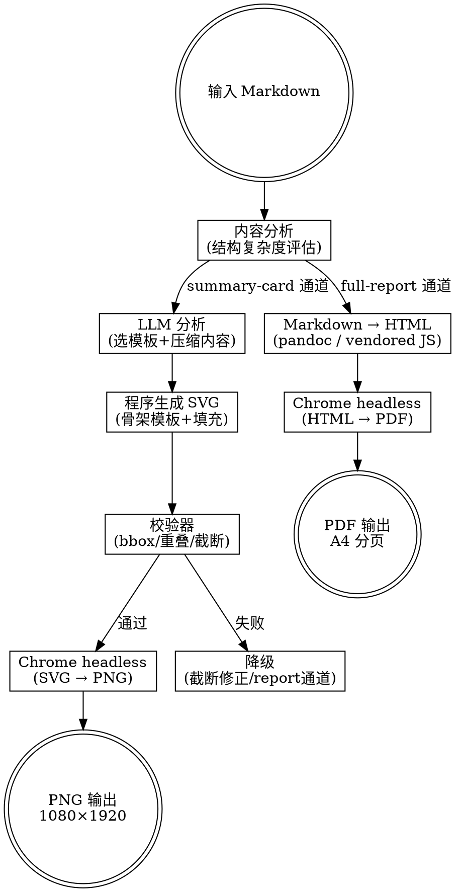

# markdown-to-anything skill 设计文档

> REQUIRED SUB-SKILL: Use superpowers:writing-plans before implementation

**日期**：2026-02-23
**状态**：待实现
**目标设备**：iPhone 17（2622×1206 px，460 PPI，3x 逻辑缩放）

---

## 1. 定位与边界

### 1.1 核心定位

`markdown-to-anything` 是一个**独立通用的格式转换 skill**，负责将 Markdown 文档渲染为适合 Telegram 推送的图片或文档。

**唯一假设**：输入是 Markdown 文本。
**不依赖**：不了解 A股/GitHub 等业务结构，不含领域特定逻辑。

### 1.2 输出格式

| 格式 | 说明 |
|------|------|
| PNG  | 最终格式，适合 Telegram 发图（summary-card 通道） |
| PDF  | 最终格式，适合完整报告阅读（full-report 通道） |
| SVG  | **中间格式**，不直接输出给用户 |

---

## 2. 双通道架构



### 2.1 通道触发逻辑

| 条件 | 自动触发通道 |
|------|-------------|
| `--mode card` | summary-card |
| `--mode report` | full-report |
| `--mode auto`（默认） | section ≤ 6 且无复杂表格/代码块 → card；否则 → report |

"复杂表格"定义：列数 > 4 或行数 > 10。
"复杂代码块"定义：代码块数量 > 1 或单块行数 > 20。

---

## 3. summary-card 通道

### 3.1 SVG 由谁生成

**程序生成 SVG**。LLM 仅负责：
1. 从 Markdown 中提炼关键内容（压缩/摘要）
2. 从模板库中选择合适的骨架模板

**最终几何由程序控制**，LLM 输出结构化 spec，程序填充到 SVG 模板。

### 3.2 LLM 输出的 spec 格式

```json
{
  "template": "hero-summary",
  "title": "2026-02-22 A股复盘",
  "subtitle": "震荡偏强，题材分化",
  "bullets": [
    "主线：AI算力板块领涨",
    "风险：部分高位股回调压力大",
    "明日关注：半导体设备开盘方向"
  ],
  "highlight": "精选标的：XX 评分 8.5",
  "theme": "dark",
  "font_size": "medium"
}
```

### 3.3 通用骨架模板库

模板不含业务语义，只表达信息组织方式：

| 模板名 | 适用场景 | 内容区域 |
|--------|----------|----------|
| `hero-summary` | 有明确标题+要点列表 | 大标题、副标题、3-6 条 bullets、highlight |
| `headline-list` | 多分组列表 | 标题、2-3 分组 × 4-5 条目 |
| `metrics-grid` | 有量化指标 | 标题、2×2 或 3×2 指标卡、注释 |
| `quote-and-bullets` | 结论型/引言型 | 引言块、要点列表 |

LLM 根据 Markdown 结构特征自动选择，调用方可通过 `--template` 显式指定。

### 3.4 SVG 画布规格

```
画布尺寸：1080 × 1920 px（9:16，竖屏标准）
目标设备：iPhone 17（物理宽 1206px，等比放大 ≈1.12x 满屏显示）
```

字体大小（SVG px 单位）：

| 档位 | body | h1 | h2 | h3 | meta/label |
|------|------|----|----|----|----|
| small  | 36 | 54 | 45 | 40 | 28 |
| **medium（默认）** | **44** | **66** | **55** | **48** | **34** |
| large  | 52 | 78 | 65 | 57 | 40 |

设计依据：medium 44px 在 iPhone 17 全屏显示（×1.12 放大）后约 49 物理像素 ≈ 16pt，接近 iOS 默认正文 17pt。

### 3.5 主题系统

主题控制四个 token（其余布局固定）：

| token | dark（默认） | blue | 说明 |
|-------|-------------|------|------|
| `bg` | `#0d1117` | `#0a1628` | 背景色 |
| `accent` | `#58a6ff` | `#4fc3f7` | 强调色（链接、左边线、高亮数字） |
| `accent_soft` | `#1c2432` | `#0d2137` | 卡片背景 |
| `text` | `#e6edf3` | `#e8f4fd` | 正文色 |
| `muted` | `#8b949e` | `#7bafd4` | 次要文字 |

正文色始终高对比，accent 只用于强调，不影响正文。

### 3.6 校验器规则

渲染后通过 Chrome CDP `getBBox()` 检测：
- 任意文本/元素超出画布边界 → 报错
- 任意两元素重叠面积 > 10% → 报错
- 字体未加载（fallback 到 monospace） → 警告
- 文件大小 > 3MB → 警告

校验失败时的处理：
1. 尝试确定性修正：长文本截断 + 省略号、降一级字号
2. 修正后仍失败 → 降级到 full-report 通道输出 PDF

---

## 4. full-report 通道

### 4.1 Markdown → HTML 渲染

优先级：`pandoc` → vendored `marked.min.js`（浏览器端渲染）

Vendored JS 方案：
- `scripts/vendor/marked.min.js` 随 skill 分发，无需 npm 安装
- HTML 壳子注入 `<script type="text/plain" id="md-source">` + `marked.parse()`
- Chrome 截图前等待 `window.__md_rendered = true`

### 4.2 HTML CSS 规格

目标：750px 视口 + Chrome 3x DPR，输出 A4 PDF。

字体大小（CSS px，在 3x DPR 下渲染）：

| 档位 | body | h1 | h2 | h3 | table | meta |
|------|------|----|----|----|----|-----|
| small  | 24 | 40 | 33 | 28 | 20 | 20 |
| **medium（默认）** | **28** | **48** | **39** | **33** | **23** | **22** |
| large  | 32 | 56 | 45 | 38 | 26 | 25 |

line-height: 1.65（small/medium）/ 1.60（large）

h1-h3 比例：`h1 = body × 1.75`，`h2 = body × 1.42`，`h3 = body × 1.21`（用 CSS `calc()`，不写死各档）

### 4.3 PDF 生成

通过 Chrome CDP `Page.printToPDF`：
- Paper: A4（8.27×11.69 英寸）
- Margin: 0.4 英寸（四边）
- 等待 `document.fonts.ready`（确保字体嵌入）
- 字体：macOS 优先 `Noto Sans SC`（Google Fonts CDN）；Linux 优先本地 Noto CJK

---

## 5. CLI 接口

### 5.1 入口脚本

```bash
python scripts/convert.py <input.md> [options]
```

### 5.2 参数

| 参数 | 默认值 | 说明 |
|------|--------|------|
| `--mode card\|report\|auto` | `auto` | 选择通道 |
| `--format png\|pdf\|both` | 依 mode | card → png，report → pdf |
| `--theme dark\|blue` | `dark` | 主题 |
| `--font-size small\|medium\|large` | `medium` | 字体档位 |
| `--output <path>` | `~/.openclaw/media/...` | 输出路径 |
| `--stdout-manifest` | off | 把结果 JSON 打到 stdout |
| `--template <name>` | auto | 强制指定 SVG 骨架模板 |

### 5.3 stdout manifest 格式

```json
{
  "mode": "card",
  "format": "png",
  "files": ["/path/to/report_card.png"],
  "theme": "dark",
  "font_size": "medium",
  "template_used": "hero-summary",
  "markdown_engine": "pandoc",
  "render_ms": 1240,
  "warnings": []
}
```

---

## 6. 文件结构

```
skills/markdown-to-anything/
├── SKILL.md                  # skill 触发与工作流
├── scripts/
│   ├── convert.py            # CLI 入口，编排两条通道
│   ├── analyze.py            # Markdown 结构分析，决定 mode/template
│   ├── card_render.py        # summary-card 通道：LLM spec → SVG
│   ├── report_render.py      # full-report 通道：Markdown → HTML → PDF
│   ├── screenshot.js         # Chrome CDP：PNG 截图 + PDF 生成（从 a-share 迁移）
│   ├── validator.py          # SVG 校验（bbox 检测，通过 CDP）
│   └── vendor/
│       └── marked.min.js     # vendored Markdown parser（无 npm 依赖）
├── templates/                # SVG 骨架模板
│   ├── hero-summary.svg
│   ├── headline-list.svg
│   ├── metrics-grid.svg
│   └── quote-and-bullets.svg
└── references/
    └── chrome-cdp.md         # Chrome CDP 用法参考
```

---

## 7. 与现有 skill 的关系

### 7.1 迁移顺序

1. 实现 `markdown-to-anything` 完整能力（含两条通道）
2. `openclaw-github-tracker` 先切换（结构更简单）
3. `a-share-review-planner` 后切换（长文/复杂表格）
4. 两个 skill 删除各自的 `report_to_html.py` / `report_to_image.py`

### 7.2 调用方式（迁移后）

```bash
# a-share 复盘：发一张摘要卡 + 完整 PDF
python ~/.openclaw/skills/markdown-to-anything/scripts/convert.py \
  report.md --mode auto --format both --theme dark --stdout-manifest

# github 日报：只发摘要卡
python ~/.openclaw/skills/markdown-to-anything/scripts/convert.py \
  report.md --mode card --theme blue --stdout-manifest
```

---

## 8. 已知问题与修复

- `report_to_image.py` 中 CSS `body font-size: 30px` 与 `report_to_html.py` 中 `body font-size: 15px` 不一致 → 新 skill 统一为 medium 28px（3x DPR 路径）
- `report_to_html.py`（两份）CSS 风格分叉 → 新 skill 统一样式系统，用 theme token 区分

---

## 9. 不在本 skill 范围内

- Markdown 内容的业务加工（摘要、抽取）→ 由调用方 skill 负责
- Telegram 发送 → 由调用方 skill 负责
- 数据抓取/分析 → 不相关
