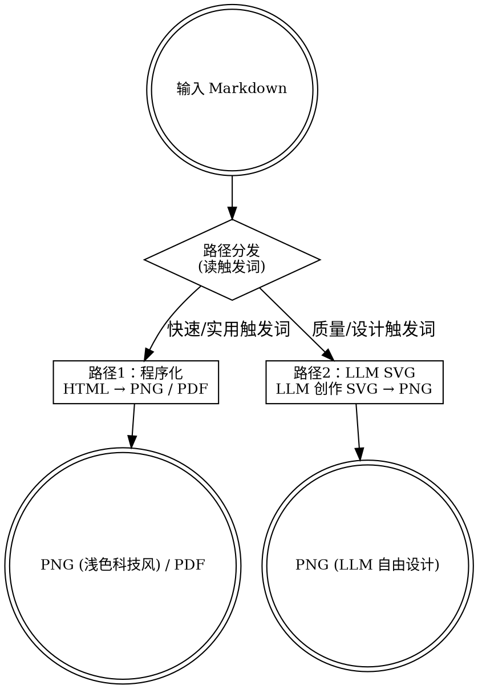

# markdown-to-anything v2 重设计文档

> REQUIRED SUB-SKILL: Use superpowers:writing-plans before implementation

**日期**：2026-02-23
**状态**：待实现
**背景**：v1 实测后发现程序化 SVG 效果差，且 SKILL.md 结构不符合 Skills-Dev-Guide.md 最佳实践

---

## 1. 问题诊断

### 1.1 用户体验问题

| 问题 | 根因 |
|------|------|
| 程序化 SVG 效果差 | SVG 模板骨架限制了信息密度和视觉层次；LLM spec 到模板填充的过程损失了创意空间 |
| LLM 直出 SVG 比程序化好得多 | LLM 可以自由布局、使用渐变、图标、动态分组，不受固定 slot 限制 |
| "转成图片"场景不需要高质感 | 程序化路径本质上是"快速可读"，应该走 HTML→PNG，而非费劲生成 SVG |

### 1.2 SKILL.md 结构问题（对照 Skills-Dev-Guide.md）

| 反模式 | 现状 | 修复方向 |
|--------|------|---------|
| description 含工作流摘要 | 描述了两种路径的实现细节 | 只写触发场景列表 |
| body 过度详细 | CLI 参数全表在 body | 移到 references/ |
| 无 Iron Law | 两路径没有明确切换规则 | 加路径决策 Iron Law |
| 无 Hard Gate | 程序化/LLM SVG 可以混淆 | 加触发词 Hard Gate |
| references 未条件引用 | 所有内容堆在 body | 按需加载声明 |

---

## 2. 新架构：两路径设计



### 2.1 路径分发规则（Iron Law）

**路径1（程序化）触发词**：转成图片、转成PDF、导出PNG、图片报告、PDF报告、快速导出、图片版、导出文件

**路径2（LLM SVG）触发词**：高质量图片、高品质卡片、海报风格、卡片风格、设计感、好看一点、自由风格、美观卡片、精美图片

无触发词时默认走路径1（PDF）。

---

## 3. 路径1：程序化（MD → HTML → PNG/PDF）

### 3.1 转换链

```
Markdown → HTML (pandoc / marked / fallback) → Chrome CDP → PNG screenshot / PDF print
```

PNG 和 PDF 共用同一 HTML 生成路径，只有 Chrome 命令不同。

### 3.2 新主题：`light`（浅色科技风）

路径1 PNG 默认使用 `light` 主题：

| token | light 值 | 说明 |
|-------|----------|------|
| bg | `#f8fafd` | 浅蓝灰背景 |
| text | `#111827` | 深色正文 |
| accent | `#2563eb` | 蓝色强调 |
| muted | `#6b7280` | 灰色次要文字 |
| card | `#ffffff` | 白色块背景 |
| border | `#e5e7eb` | 浅灰边框 |

报告 PDF 保持现有 `blue` 主题（已有，无需改动）。

### 3.3 PNG 截图参数（区别于 PDF）

```bash
# HTML → PNG（750px 宽，3x DPR，截图）
node scripts/screenshot.js --png <html_file> <output.png> 3 750 0
```

与 SVG PNG 截图不同：viewport 750px（非 1080px），DPR=3，适合报告内容全宽展示。

### 3.4 需要的代码变更

**`report_render.py`**：
- 新增 `render_markdown_to_png(input_md, output_png, theme, font_size, prefer_engine)` 函数
- 复用现有 `render_markdown_to_html()` 生成 HTML
- 调用 `screenshot.js --png <html> <png> 3 750 0` 截图
- `light` 主题加入 `THEMES` 字典

**`convert.py`**：
- 移除第 112-114 行的"report+png → card"重定向逻辑
- 当 `mode=report` 且 `format=png` 时：调用 `render_markdown_to_png()`
- `--mode auto` 时：无触发词信息（脚本不知道触发词），默认输出 PDF
- 新增 `--theme` 选项支持 `light`（之前只有 dark/blue）

**`analyze.py`**：
- 不改（路径1的 mode 选择基于脚本参数，不再依赖自动分析）

**`card_render.py` / `templates/`**：
- 保留文件，但不在 SKILL.md 的主流程中引用
- 成为"历史遗留"，不删除但降级为内部工具

---

## 4. 路径2：LLM SVG（MD → 自由 SVG → PNG）

### 4.1 设计原则

LLM **完全自由**创作 SVG，不再使用任何模板。只保留最低限度约束：

| 约束项 | 约束值 | 原因 |
|--------|--------|------|
| 画布尺寸（默认） | `width="1080" height="1920"` | 9:16，社交平台标准竖版 |
| 画布尺寸（全屏贴合） | `width="1080" height="2340"` | 19.5:9，现代手机贴合比例 |
| SVG 命名空间 | `xmlns="http://www.w3.org/2000/svg"` | Chrome CDP 渲染必须 |
| 最小正文字号 | body ≥ 40px SVG px | 手机可读下限（见下方说明） |
| 最小 meta 字号 | meta/caption ≥ 28px SVG px | 辅助信息可读下限 |

不约束的内容：布局、颜色方案、字体搭配、装饰元素、图标、形状、分组方式。

### 4.1.1 画布尺寸：手机端适配分析

**iPhone 17 参数（2026 旗舰参考）**：
- 物理像素：2622 × 1206（纵向）
- PPI：460，DPR：3x
- 逻辑分辨率：874 × 402 pt
- 宽高比：1206:2622 ≈ **1:2.174**（比 9:16 更瘦长）

**各画布方案对比**：

| 画布规格 | 宽高比 | 用途 | 在 iPhone 17 上的效果 |
|----------|--------|------|----------------------|
| 1080 × 1920 | 9:16 | 微信/小红书标准竖版 | 顶底各留 ≈ 9% 空白边（letterbox） |
| 1080 × 2340 | 19.5:9 | 现代手机全面屏贴合 | 接近全屏，极小留白 |
| 1206 × 2622 | 精确原生 | iPhone 17 物理像素 | 完全贴合，PNG 文件较大 |

**推荐：默认 `1080×1920`，全屏场景用 `1080×2340`**
- 9:16 是所有社交平台（微信/朋友圈/小红书/微博）的竖版内容标准
- letterbox 仅在系统图库全屏查看时出现，分享场景无影响
- 若用户明确要求"全屏贴合"，LLM 改用 `1080×2340`

### 4.1.2 最小字号：换算验证

SVG 40px 字号在 iPhone 17 上的实际视觉大小：

```
SVG 40px → 输出 PNG 1080px 宽 → iPhone 17 显示（1206px 宽）
缩放比 = 1206 / 1080 ≈ 1.117x
实际物理像素 = 40 × 1.117 ≈ 44.7px
实际物理尺寸 = 44.7 / 460 ppi ≈ 2.45mm

对比 iOS 默认正文（17pt × 163 ppi = 17/163 inch ≈ 2.65mm）
比值 ≈ 92%（略小但可读）
```

结论：**40px 下限合理**，接近 iOS 默认正文大小，满足手机可读性要求。

### 4.2 工作流（LLM 操作）

```bash
# Step 1: LLM 分析 Markdown 内容，自由创作 SVG，写入文件
# SVG 根元素必须满足：<svg xmlns="http://www.w3.org/2000/svg" width="1080" height="1920">

# Step 2: SVG → PNG
node scripts/screenshot.js --png /tmp/card_llm.svg /tmp/card_llm.png 3 1080 0

# Step 3（可选）: 校验 - 有布局问题时修正后重复 Step 2
python scripts/validator.py /tmp/card_llm.svg --json
```

### 4.3 SKILL.md 中对 LLM 的指引（原则层面）

只给方向，不给模板：
- 风格参考：深色底 + 强调色要点、浅色科技风、杂志排版、极简线条风等
- 内容提炼建议：摘要 ≤ 6 条要点，每条 ≤ 25 字，突出 1-2 个核心数据
- 防重叠提示：行间距 ≥ 字号 × 1.5，估算 CJK 字符宽度 ≈ 字号 px

---

## 5. SKILL.md 重构（按 Skills-Dev-Guide.md 最佳实践）

### 5.1 新 description（只写触发条件）

```yaml
description: >
  Use when converting Markdown into shareable images or documents.
  (1) "转成图片"/"转成PDF"/"图片报告"/"导出PNG" → 程序化路径（MD→HTML→PNG/PDF，浅色科技风）
  (2) "高质量图片"/"卡片风格"/"海报"/"好看一点"/"设计感" → LLM SVG 路径（LLM 自由创作 SVG→PNG）
```

现有 description 含路径实现描述，违反 Skills-Dev-Guide.md §description公式（触发前不可见的内容无意义）。

### 5.2 新 body 结构（目标 <100 行）

```
## 路径分发（Iron Law）
[触发词表格]

## 路径1：程序化（HTML → PNG/PDF）
[2-3行说明 + 命令]

## 路径2：LLM SVG（LLM → SVG → PNG）
[画布约束表 + 3步工作流]

## 输出
[manifest 格式简述]

## 更多参考
[条件引用声明：只在特定情况下才读 references/]
```

### 5.3 迁移到 references/ 的内容

| 当前 body 内容 | 迁移至 |
|----------------|--------|
| CLI 全参数表 | `references/cli-params.md` |
| 调试子命令 | `references/debug-commands.md` |
| 字号系统（场景A/B/C） | `references/font-spec.md` |
| 依赖与降级 | `references/dependencies.md` |
| 开发与测试命令 | `references/dev-guide.md` |

### 5.4 Iron Law 示例（写入 SKILL.md）

```
NO PNG output WITHOUT checking trigger words FIRST.

- 质量触发词（高质量/海报/卡片/好看）→ 路径2（LLM SVG）
- 其他触发词或无触发词 → 路径1（程序化）
- No exceptions. "默认情况" 也走路径1。
```

### 5.5 条件引用声明（减少默认加载）

```markdown
## 更多参考

- CLI 完整参数：`references/cli-params.md`（需要调整参数时读）
- 字号规格：`references/font-spec.md`（需要调整字号时读）
- 调试命令：`references/debug-commands.md`（遇到渲染问题时读）
```

---

## 6. 实现步骤（供 writing-plans 生成）

1. **`report_render.py`**: 新增 PNG 截图模式
   - 新增 `THEMES["light"]` 字典
   - 新增 `render_markdown_to_png()` 函数（复用 HTML 生成，调用 screenshot.js）
   - 新增 `--format png` CLI 参数

2. **`convert.py`**: 路径1支持 PNG 输出
   - 移除 `report + png → card` 强制重定向
   - `mode=report + format=png` 时调用 `render_markdown_to_png()`
   - `--theme` 新增 `light` 选项（默认 `light` for PNG, `blue` for PDF）
   - 从 `report_render` 导入 `render_markdown_to_png`

3. **`references/` 新建**：
   - `cli-params.md`：完整 CLI 参数表
   - `debug-commands.md`：分析/校验/子命令
   - `font-spec.md`：三场景字号规格（来自 Skills-Dev-Guide.md §七）
   - `dependencies.md`：依赖与降级策略

4. **`SKILL.md` 重写**：
   - 新 description（触发词为主）
   - body 精简至 <100 行
   - Iron Law 路径分发
   - 路径1/路径2 各 10-15 行
   - 条件 references 声明

5. **部署**：
   ```bash
   cp -r skills/markdown-to-anything/ .claude/skills/markdown-to-anything/
   cp -r skills/markdown-to-anything/ .agents/skills/markdown-to-anything/
   cp -r skills/markdown-to-anything/ ~/clawd/skills/markdown-to-anything/
   scp -r skills/markdown-to-anything/ root@43.138.150.96:/root/.openclaw/workspace-smartrader/skills/
   ```

---

## 7. 文件变动汇总

| 文件 | 变动类型 | 说明 |
|------|---------|------|
| `scripts/report_render.py` | 修改 | 新增 PNG 截图模式 + light 主题 |
| `scripts/convert.py` | 修改 | 移除 card→report 重定向，支持 report+png |
| `SKILL.md` | 重写 | 精简 body，新 description，Iron Law |
| `references/cli-params.md` | 新建 | CLI 参数详细说明 |
| `references/debug-commands.md` | 新建 | 调试子命令 |
| `references/font-spec.md` | 新建 | 字号规格三场景 |
| `references/dependencies.md` | 新建 | 依赖与降级 |
| `scripts/card_render.py` | 不变 | 保留但降级（不在主流程引用） |
| `templates/` | 不变 | 保留（card_render.py 仍可用） |

---

## 8. 不在本次范围内

- a-share-review-planner / openclaw-github-tracker 迁移（单独任务）
- 多模板 LLM SVG 预设（目前不约束风格即可）
- 自动触发词识别（由 LLM 读 SKILL.md 自行判断路径）
