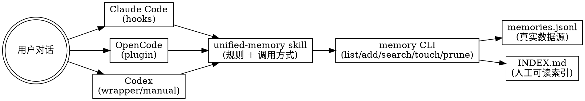

# unified-memory skill MVP 设计文档（Claude Code / Codex / OpenCode）

> REQUIRED SUB-SKILL: Use superpowers:writing-plans before implementation

**日期**：2026-02-26  
**状态**：设计中（MVP）  
**目标**：为 Claude Code / Codex / OpenCode 提供一套统一、轻量、可落盘的长期记忆机制（最大约 200 条）

---

## 1. 结论与可行性判断

该方案**可行**，且建议采用“`skill + 本地记忆 CLI + 各工具适配层`”三层结构。

可行性依据：

1. **Claude Code** 官方支持 hooks，且事件覆盖 `UserPromptSubmit`、`PreCompact`、`SessionEnd`、`SessionStart` 等，足以实现自动写入与自动读取。
2. **OpenCode** 官方支持 plugins，并提供会话事件（如 `session.compacted`）与提示词变换能力，可实现同类逻辑（方式不同于 Claude hooks）。
3. **Codex** 当前假设无 hooks（至少在本设计范围内不依赖），可通过显式命令与包装脚本降级实现同一存储协议。
4. `github_cache/skills_repos/superpowers` 已验证“Claude hooks + OpenCode plugin”双适配模式可落地，适合作为接入样例参考。

---

## 2. 设计目标与非目标

## 2.1 目标

1. 支持跨工具共享同一份记忆库（文件格式统一）。
2. 支持低成本触发写入（会话结束、compact、显式“请记住”、重复提醒）。
3. 支持低成本读取（按 topic 列表、关键词检索、按权重选取）。
4. 记忆数量上限约 200 条，使用权重与衰减淘汰。
5. 以 skill 形式安装使用，同时保持 CLI 可独立运行。

## 2.2 非目标（MVP 不做）

1. 不做向量数据库与 embedding 检索。
2. 不做跨设备同步服务（仅本地文件）。
3. 不做复杂实体图谱/关系推理。
4. 不做自动“事实真伪校验”。

---

## 3. 总体架构（推荐）



### 3.1 分层职责

1. **Skill 层**：定义何时读写、如何提示模型、如何调用工具。
2. **适配层（hooks/plugins/wrapper）**：把工具事件映射为 CLI 调用。
3. **CLI 层**：唯一写入/检索入口，保证格式一致与幂等。
4. **存储层**：`jsonl` 数据源 + `INDEX.md` 可读索引。

核心原则：**自动化逻辑分散在适配层，数据一致性集中在 CLI。**

---

## 4. 存储格式设计（MVP）

## 4.1 目录结构

```text
.memory/
├── memories.jsonl
├── INDEX.md
├── topics/
│   ├── coding_preferences.md      # 可选（MVP 可延后）
│   └── deployment_rules.md        # 可选（MVP 可延后）
└── tombstones.jsonl               # 可选（MVP 可延后）
```

MVP 推荐：

1. `memories.jsonl` 为唯一事实来源。
2. `INDEX.md` 为缓存视图（可重建）。
3. `topics/` 先不强依赖，只在需要人类维护时启用。

## 4.2 `memories.jsonl` 单条 schema（MVP）

```json
{
  "id": "mem_20260226_8f3a1d",
  "topic": "coding_preferences",
  "content": "用户偏好：修改前先阅读 AGENTS.md 与相关 Skill 指南。",
  "summary": "先读规范再改代码",
  "tags": ["workflow", "repo-rules"],
  "source": "explicit_user_memory",
  "tool": "claude-code",
  "project": "/Users/mindora/Workspace/projects/OpenclawSkills",
  "created_at": "2026-02-26T12:00:00Z",
  "updated_at": "2026-02-26T12:00:00Z",
  "weight": 8,
  "retrieval_hits": 0,
  "last_retrieved_at": null,
  "confidence": 0.95,
  "status": "active",
  "supersedes": null,
  "evidence": {
    "trigger": "UserPromptSubmit",
    "raw_excerpt": "请记住：先读 AGENTS.md"
  }
}
```

## 4.3 字段约束（MVP）

1. `topic`：小写下划线，长度建议 <= 40。
2. `content`：单条记忆正文，建议 <= 300 字（中文）或 <= 600 chars。
3. `summary`：1 行摘要，用于列表展示。
4. `weight`：整数，范围建议 `1..100`。
5. `status`：`active|superseded|archived`。
6. `source`：`explicit_user_memory|repeat_reminder|precompact_summary|session_end_summary|manual`.

---

## 5. 触发与提取规则（MVP）

## 5.1 写入触发（按优先级）

1. **显式触发**：用户说“请记住 xxx / 记住这个 / 下次不要忘了”。
2. **重复提醒触发**：同一会话内同类约束被用户重复强调（>=2 次）。
3. **PreCompact 触发**：会话 compact 前，提炼高价值长期信息。
4. **SessionEnd 触发**：会话结束时提炼稳定偏好与长期约束。

MVP 建议：先实现 `1 + 3 + 4`，重复提醒检测作为启发式增强。

## 5.2 读取触发

1. **SessionStart**：按项目维度读取 Top-N（如 5 条）高权重记忆注入上下文。
2. **用户显式请求**：如“有哪些记忆 topic”“查一下部署相关记忆”。
3. **任务前检索（可选）**：识别关键词（deploy/test/style）后做轻量检索。

MVP 建议：先实现 `SessionStart` + 显式命令读取。

## 5.3 记忆提取准则（写入门槛）

仅写入以下信息：

1. 稳定偏好（代码风格、协作方式、输出格式偏好）。
2. 长期约束（仓库规则、部署禁忌、环境习惯）。
3. 高频背景事实（项目结构、常用目录、固定命令）。
4. 明确要求未来沿用的决策。

不写入以下信息：

1. 一次性任务状态（“这次先跳过测试”）。
2. 临时错误日志、路径噪声、随机示例数据。
3. 敏感信息（token、密码、私钥、cookie、PII）。
4. 未确认真假且可能过时的事实陈述。

---

## 6. 权重、衰减与淘汰策略（上限 ~200 条）

## 6.1 初始权重

| 触发来源 | 初始权重 |
|---|---:|
| 显式“请记住” | 8 |
| 重复提醒（检测到） | 7 |
| PreCompact 提炼 | 5 |
| SessionEnd 提炼 | 4 |
| 手工 `memory add` | 6（默认，可覆盖） |

## 6.2 增权规则

1. 每次被读取并注入上下文：`+1`
2. 用户确认“对，就是这个偏好”：`+2`
3. 同 topic 新记忆与旧记忆一致：旧条目 `+1`（强化稳定性）

## 6.3 衰减规则（建议每日或每周执行）

1. 长期未命中（例如 30 天）且非显式记忆：`-1`
2. `status != active` 的条目优先降权
3. 权重最低降至 `1`，不降为负数

## 6.4 淘汰策略（超过 200 条时）

按以下排序从低到高淘汰：

1. `status = superseded|archived`
2. 低权重
3. 长期未命中
4. 低置信度
5. 内容重复（相似 summary/topic）

保留规则：

1. 显式“请记住”条目设置最小保留权重地板（如 `>=3`）。
2. 最近 7 天新写入条目默认不淘汰（冷启动保护）。

---

## 7. 冲突与更新策略

## 7.1 同 topic 新信息处理

同 topic 写入时不直接覆盖，执行三选一：

1. **merge**：内容互补，更新旧条目 `updated_at` 并合并 tags。
2. **supersede**：新信息明确替代旧信息，旧条目标记 `superseded`，新条目 `supersedes=<old_id>`。
3. **separate**：同 topic 下不同子规则，保留多条并靠 tags 区分。

MVP 可先用简单策略：

1. `topic + summary` 相同视为 `merge`
2. `topic` 相同但内容差异大时新建条目并标记旧条目 `superseded`（仅在检测到“改成/不要再/以后统一”这类词时）

---

## 8. 安全与隐私护栏（必须）

## 8.1 敏感信息过滤

在 CLI 写入前执行本地过滤：

1. 明显密钥模式（API key、token、private key header）
2. cookie / session 字段
3. 纯长串高熵文本（启发式）

命中后行为：

1. 默认拒绝写入并记录警告到 stderr
2. 可选 `--force`（MVP 不建议对自动触发开放）

## 8.2 用户控制能力

MVP 必须提供：

1. `memory list`
2. `memory show <id|topic>`
3. `memory add`
4. `memory search <query>`
5. `memory delete <id>`
6. `memory prune`
7. `memory rebuild-index`

这样用户可审计、可纠错、可清理。

---

## 9. 跨工具接入方案（MVP）

## 9.1 Claude Code（hooks）

利用官方 hooks 事件：

1. `SessionStart`：读取 Top-N 记忆并注入附加上下文
2. `UserPromptSubmit`：检测显式“请记住”
3. `PreCompact`：提炼会话中的长期信息并写入
4. `SessionEnd`：收尾提炼并写入

实现形态：

1. 一个或多个 hook 脚本（Shell/Python）
2. 统一调用 `memory` CLI
3. 输出官方要求的 JSON 结构用于上下文注入（参考 superpowers 的 `hooks/session-start.sh`）

## 9.2 OpenCode（plugins）

利用官方 plugin 机制：

1. `session.start`：读取记忆并注入系统提示（或等效 transform）
2. `session.compacted`：触发 compact 后记忆提炼
3. `message.sent`（或等效）检测显式“请记住”
4. `session.idle`（可选）做异步 prune / index rebuild

实现形态：

1. `~/.config/opencode/plugins/<plugin>.js`
2. Plugin 内调用本地 `memory` CLI（Node child_process）
3. 与 Claude 共享同一 `.memory/` 协议

## 9.3 Codex（无 hooks 的降级方案）

MVP 采用降级路径，不阻塞整体方案：

1. **显式命令模式**：用户/skill 调用 `memory add/search/list`
2. **包装脚本模式（可选）**：通过 `codex-memory` wrapper 在会话开始/结束前后执行辅助逻辑
3. **技能驱动模式**：在 `SKILL.md` 中明确要求任务开始前调用 `memory search`、任务结束时根据条件调用 `memory add`

结论：Codex 没有 hooks 不影响统一记忆格式，只影响自动化程度。

---

## 10. Skill 设计（MVP）

Skill 名称建议：`unified-memory`

### 10.1 Skill 的职责

1. 教会模型“什么值得记忆、什么不该记忆”
2. 规范何时调用 `memory` CLI
3. 提供简短操作模板（列 topic、检索、追加、删除）
4. 约束输出不要把全部记忆灌入上下文

### 10.2 Skill 的非职责

1. 不直接实现持久化逻辑（由 CLI 负责）
2. 不替代 hooks/plugin（仅在无自动化时兜底）

### 10.3 建议前置规则（SKILL.md 中）

1. 先 `memory search` 再做关键任务（如部署、代码规范、项目约束）
2. 用户显式“请记住”时必须先复述再写入
3. 写入前执行敏感信息检查（由 CLI 强制）
4. 不把临时任务细节写成长久记忆

---

## 11. CLI 命令接口（MVP 草案）

```bash
memory list [--topic <topic>] [--limit 50]
memory topics [--limit 100]
memory search <query> [--limit 10]
memory show <id-or-topic>
memory add --topic <topic> --content <text> [--tags a,b] [--weight 8] [--source manual]
memory touch <id> [--delta 1]
memory delete <id>
memory prune [--max-items 200]
memory rebuild-index
```

输出要求（MVP）：

1. 默认终端友好文本输出
2. `--json` 可选（方便 hooks/plugins 集成）

## 11.1 `/mem-autoload` slash 命令（新增需求）

目标：自动把权重最高的前 20 条 memory **topic** 加载进上下文，**不加载内容**。

设计原则：

1. 仅注入 `topic`（必要时附带极短标签），避免上下文膨胀。
2. 默认按当前项目路径过滤（项目级记忆库）。
3. 只取 `status=active`。
4. 按 `weight desc, last_retrieved_at desc, updated_at desc` 排序取前 20。

建议实现方式：

1. CLI 增加命令：`memory autoload-topics [--limit 20] [--json]`
2. 各工具通过 slash 命令触发该 CLI，并把结果以简短列表注入当前会话
3. 触发后对命中的 memory 执行 `touch`（可选，MVP 建议开启，保证真正常用 topic 升权）

建议输出示例（文本）：

```text
[mem-autoload] top topics (20):
- coding_preferences
- deployment_rules
- test_requirements
- output_format_preferences
```

建议输出示例（json）：

```json
{
  "topics": [
    "coding_preferences",
    "deployment_rules",
    "test_requirements"
  ],
  "count": 3
}
```

说明：

1. `/mem-autoload` 加载的是“目录感知层”（topics），用于提醒模型先检索再执行。
2. 当任务涉及具体规则时，模型再调用 `memory search` / `memory show` 拉取内容。

---

## 12. 错误处理与幂等性

## 12.1 错误处理

1. 文件不存在时自动初始化 `.memory/`
2. 单行 JSON 损坏时跳过该行并告警（不中断全库读取）
3. 写入失败时返回非 0，并不破坏原文件（临时文件 + 原子替换用于 prune/rebuild）

## 12.2 幂等性

1. `memory add` 支持 `--dedupe-key`（MVP 可内部按 `topic+summary` 去重）
2. `memory rebuild-index` 可重复执行，结果一致
3. hook/plugin 重复触发时不应造成大量重复条目

---

## 13. MVP 实施范围（建议拆分）

### Phase 1（最小可用）

1. `memory` CLI：`list/topics/search/add/delete/prune/rebuild-index`
2. `memories.jsonl` + `INDEX.md`
3. `unified-memory` skill（仅手动调用流程）
4. Claude Code `SessionStart` + `UserPromptSubmit` hooks（显式记忆写入 + 启动读取）
5. `/mem-autoload`（加载 Top20 topics，不加载内容）

### Phase 2（增强自动化）

1. Claude Code `PreCompact` + `SessionEnd`
2. OpenCode plugin 适配（`session.start` / `session.compacted` / `message.sent`）
3. 权重衰减任务与更稳健的去重/冲突处理

### Phase 3（可选）

1. `topics/` 文件化视图
2. 轻量语义相似去重（不引入向量库）
3. 导入/导出与同步

---

## 14. 测试计划（MVP）

## 14.1 CLI 单元测试

1. 初始化空库
2. 添加记忆并检索命中
3. 重复添加去重/合并
4. prune 超限淘汰
5. rebuild-index 结果正确
6. 敏感信息过滤拦截

## 14.2 集成测试（Claude Code）

1. `SessionStart` 注入 top memories
2. 用户发送“请记住 xxx”后新增条目
3. 重启会话后能读到刚才记忆
4. 异常情况下 hook 不应阻塞主流程（超时/CLI 不存在）

## 14.3 集成测试（OpenCode）

1. plugin 加载成功
2. `message.sent` 触发显式记忆写入
3. `session.compacted` 触发提炼写入（Phase 2）
4. 系统提示注入不导致 agent 重置（参考 superpowers 的历史坑）

---

## 15. 开放问题（进入实现前确认）

1. 已确认：记忆库位置固定为**项目级** `.memory/`（MVP 不做用户级合并）。
2. 已确认：“重复提醒”由 **LLM 判断**（hooks/plugins 仅负责触发与调用 CLI）。
3. 待确认：`/mem-autoload` 在各工具中的实现形态是否统一命名（Claude/OpenCode/Codex 都叫 `/mem-autoload`，或平台分别映射）。
4. 待确认：`PreCompact` / `SessionEnd` 的提炼是否允许调用 LLM，还是先做规则提取（MVP 推荐显式记忆优先，自动提炼后置）。

---

## 16. 参考依据（本次设计）

1. Claude Code 官方 Hooks 文档（读取事件与 hook 输出形态）  
   `https://code.claude.com/docs/en/hooks`
2. OpenCode 官方 Plugins 文档（读取 plugin 能力、事件钩子与系统提示变换）  
   `https://opencode.ai/docs/plugins/`
3. 本地参考实现：`github_cache/skills_repos/superpowers/hooks/hooks.json`
4. 本地参考实现：`github_cache/skills_repos/superpowers/hooks/session-start.sh`
5. 本地参考实现：`github_cache/skills_repos/superpowers/.opencode/plugins/superpowers.js`
