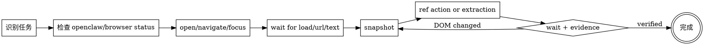

# openclaw-browser skill 设计文档

> REQUIRED SUB-SKILL: Use superpowers:writing-plans before implementation

**日期**：2026-03-11
**状态**：已批准，待实现
**目标**：创建一个通用 `openclaw-browser` skill，指导 AI 用 OpenClaw CLI 完成页面读取、交互、调试、截图与环境模拟。

---

## 1. 定位与边界

`openclaw-browser` 是一个 **CLI-first 的通用浏览器操作 skill**。
它不绑定任何具体网站，不内置站点规则，不承担业务分析，只负责把 OpenClaw 浏览器命令组织成稳定、可复现的执行流程。

**输入**：
- 用户给出的 URL、页面目标、交互目标、调试目标
- 本地可用的 `openclaw` CLI

**输出**：
- 当前会话中的浏览器操作结果
- 必要时产出截图、PDF、控制台日志、网络请求结果或结构化提取内容

**明确不做**：
- 不写站点专用解析器
- 不把 Playwright/JS 脚本重包装成另一套 DSL
- 不为兼容旧行为增加额外说明

## 2. 设计原则

### 2.1 Snapshot-first

绝大多数交互命令依赖 `snapshot` 生成的 `ref`。因此 skill 的主流程必须强制：

1. 先确认 tab 与页面状态
2. 再 `snapshot`
3. 再执行 `click` / `hover` / `type` / `fill` / `select` / `drag`
4. DOM 改变后重新 `snapshot`

### 2.2 Wait-before-guess

页面状态变化必须通过 `wait` 明确同步。优先使用：

- `wait --load`
- `wait --url`
- `wait --text`
- 直接等待 CSS selector

只有在上述方式不足时才允许 `wait --fn`。

### 2.3 Evidence-first

当任务涉及调试、取证、失败排查或交互确认时，skill 要求至少输出一种证据：

- `screenshot`
- `pdf`
- `console`
- `requests`
- `errors`
- `responsebody`

## 3. 结构设计

目录采用最小可用结构：

```text
skills/openclaw-browser/
├── SKILL.md
└── references/
    ├── cli-cheatsheet.md
    ├── workflow-patterns.md
    └── safety-and-debugging.md
```

### 3.1 SKILL.md

只保留四类内容：

- 触发条件与范围
- 前置检查
- 固定工作流
- 硬约束与完成判定

### 3.2 references/cli-cheatsheet.md

按命令分组，提供最小示例：

- 会话与 profile
- tab 管理
- 页面交互
- 等待与提取
- 调试与取证
- 环境模拟

### 3.3 references/workflow-patterns.md

沉淀高频模式：

1. 打开页面并读取主要内容
2. 基于 snapshot 的点击与输入
3. SPA 页面等待与重新 snapshot
4. 截图、console、requests 联合调试
5. 设备/时区/地理位置模拟验证

### 3.4 references/safety-and-debugging.md

集中约束最容易出错的点：

- `evaluate --fn` 与 `wait --fn` 的使用边界
- `ref` 漂移与重新 snapshot 规则
- `target-id` 选择与多 tab 管理
- `--json` 优先
- profile 隔离

## 4. 核心工作流



## 5. 前置检查

进入执行前必须确认：

1. `command -v openclaw`
2. `openclaw browser status`
3. 需要独立环境时指定 `--browser-profile`
4. 需要结构化输出时开启 `--json`

若浏览器未启动，先执行 `openclaw browser start`。

## 6. 完成判定

任务仅在以下条件满足时算完成：

- 页面已导航到目标位置
- 必要交互已执行并被验证
- 若页面结构变化，已重新 snapshot 并确认结果
- 若任务要求调试或取证，已返回至少一种证据

## 7. 风险与应对

| 风险 | 应对 |
|------|------|
| 直接猜测 `ref` | 强制 snapshot-first |
| 页面异步更新导致旧 `ref` 失效 | 动作后显式 wait，并在需要时重新 snapshot |
| 滥用 `evaluate --fn` | 在 SKILL.md 里列为最后手段 |
| 多 tab 混淆 | 优先 `tabs` + `focus` + 明确 `target-id` |
| 输出不可复现 | 优先 `--json` 和显式参数 |

## 8. 成功标准

- 用户提出 OpenClaw 浏览器相关需求时，skill 能自然触发
- `SKILL.md` 保持短小，细节全部下沉到 `references/`
- 常见页面读取、交互、调试任务能沿固定工作流完成
- 关键 guardrails 足以减少错误的 `ref` 使用和不必要的 JS 注入
