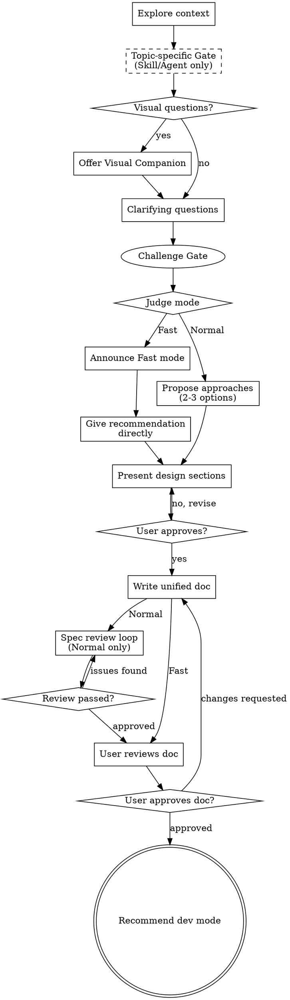

# Brainstorming: Ideas → Design + Action Plan

<!--
  用途：将头脑风暴转化为完整的设计方案 + 行动方案（含 Skill/Agent 设计前置检验）
  模式：Normal（默认）/ Fast（Claude 自动判断）
  输出：docs/brainstorming/specs/YYYY-MM-DD-<topic>-design.md
  终态：用户确认开发模式后执行
  关键引用：
    - assets/design-doc-template-normal.md  Normal 模式文档模板
    - assets/design-doc-template-fast.md    Fast 模式文档模板
    - assets/skill-design-template.md       Skill 设计文档模板
    - assets/agent-design-template.md       Agent 设计文档模板
    - references/principles-library.md      固定原则库（7 条）
    - references/skill-fundamentals.md      Skill 自治原则和判断标准
    - references/design-patterns.md         5 种 Skill 模式定义
    - references/agent-fundamentals.md      Agent 身份标准和判断规则
    - spec-document-reviewer-prompt.md      Spec 审查 subagent 提示词
-->

Help turn ideas into complete designs and action plans through natural collaborative dialogue.

Start by understanding the current project context, then ask questions one at a time. After clarifying questions, judge the task complexity and select the appropriate mode. Produce a unified document covering design, principles, and an actionable plan.

<HARD-GATE>
Do NOT write any code, scaffold any project, or take any implementation action until you have presented a design and the user has approved it. This applies to EVERY request regardless of perceived simplicity.
</HARD-GATE>

## Anti-Pattern: "This Is Too Simple To Need A Design"

Every request goes through this process. Fast mode exists for simple tasks — it produces a lighter document, but it still produces one. Unexamined assumptions cause the most wasted work on "simple" changes.

## Checklist

Create a task for each item and complete them in order:

1. **Explore project context** — check files, docs, recent commits
2. **Topic-specific Gate** — if designing a Skill or Agent, run the corresponding pre-check (see below); skip for general brainstorming
3. **Offer visual companion** (if topic will involve visual questions) — own message, no other content
4. **Ask clarifying questions** — one at a time; purpose, constraints, success criteria
5. **Challenge Gate** — before proposing any solution, raise the strongest objection to the core premise (see below); hold the position unless given a substantive counter-argument
6. **Judge mode** — after Challenge Gate, assess complexity and select Normal or Fast; announce Fast mode if chosen
7. **Propose approaches** — Normal: 2-3 options with trade-offs and recommendation; Fast: give recommendation directly
8. **Present design** — section by section, get user approval after each
9. **Write unified doc** — use the appropriate template, save to `docs/brainstorming/specs/YYYY-MM-DD-<topic>-design.md`, commit
10. **Spec review loop** — (Normal only) dispatch spec-document-reviewer subagent; max 3 iterations, then surface to human
11. **User reviews doc** — ask user to confirm before proceeding (both modes)
12. **Recommend development mode** — propose Subagent or Inline execution; wait for user to confirm, then execute immediately

**Fast mode: abbreviated Challenge Gate (root cause only, 1-2 points); skips step 9. All other steps run in both modes.**

## Process Flow

## Topic-specific Gate (Step 2)

Only applies when the user wants to design a **Skill** or **Agent**. General brainstorming skips to Step 3.

After exploring context, detect topic by user wording and exploration signals:
- **Skill signals**: "封装"、"工具"、"CLI"、specific script/spec dependencies
- **Agent signals**: "角色"、"审查官"、"分析师"、semantic judgment needed
- **General**: everything else → skip to Step 3

If signals conflict with user's stated topic, challenge proactively.

**Path A — Skill Gate:** Read `references/skill-fundamentals.md` and `references/design-patterns.md`. Run capability check (真实性/必要性/自治性) and pattern selection per those docs. Pass → proceed with `assets/skill-design-template.md`. Fail → terminate or adjust.

**Path B — Agent Gate:** Read `references/agent-fundamentals.md`. Run identity audit (Role × Agency × Ownership) per that doc. Pass → proceed with `assets/agent-design-template.md`. Fail → auto-downgrade to Path A.

## The Process

### Understanding the idea

- Check the current project state first (files, docs, recent commits)
- Assess scope before asking detailed questions: if the request describes multiple independent subsystems, flag this immediately and help decompose into sub-projects
- Ask questions one at a time — if a topic needs more exploration, break into multiple messages
- Prefer multiple choice questions when possible
- Focus on: purpose, constraints, success criteria

### Challenge Gate

This step runs BEFORE proposing any solution. Its purpose is to surface the strongest objection to the user's premise — not to be contrarian, but to catch wrong-direction decisions before implementation begins.

**Three mandatory checks (Normal mode):**

1. **Root cause test** — Is the user solving the actual problem, or patching a symptom? State clearly if the proposed solution is treating the wrong layer (e.g., "this is a workaround for a prompt constraint issue, not a real architectural need").

2. **Project standards test** — Apply the project's own evaluation criteria against the proposal. For agents, use Role × Agency × Ownership. For skills, check CLI-ability and autonomy rules. Cite the specific standard and explain why the proposal may fail it.

3. **Fragile assumptions test** — List the 2-3 assumptions the idea depends on that are most likely to be wrong. Make each assumption explicit and falsifiable.

**Rules:**
- Present the challenge in its own message before moving to mode judgment.
- Do NOT walk back the challenge when the user defends their idea. Either accept the defense if it addresses the challenge substantively, or maintain the challenge and note it as unresolved: *"挑战未解决，但你选择继续。"*
- Generic objections ("this might not work") are forbidden. Every challenge must cite a specific reason, principle, or project constraint.

**Fast mode:** root cause test only (1-2 points); skip project standards and fragile assumptions tests.

### Judging the mode

After clarifying questions are complete, assess task complexity:

**Normal mode** (default) — choose when:
- Involves architectural decisions
- Touches multiple modules or files
- Requires trade-off analysis
- Ambiguous requirements that benefit from multiple options

**Fast mode** — choose when:
- Single-file change with a clear solution
- Configuration update or small fix
- Requirements are unambiguous and solution is obvious

**Fast mode announcement (fixed wording):**
> *"这是一个相对简单的改动，我将使用 Fast 模式——方案直接给出，不做多方案对比，输出轻量文档。"*

### Exploring approaches (Normal mode)

- Propose 2-3 different approaches with trade-offs
- Lead with your recommended option and explain why
- Be conversational, not exhaustive

### Presenting the design

- Present section by section, get confirmation after each
- Scale detail to complexity: a few sentences if straightforward, up to 200-300 words if nuanced
- Cover: architecture, components, data flow, key decisions

### Writing the unified document

Use the appropriate template:
- Normal: `assets/design-doc-template-normal.md`
- Fast: `assets/design-doc-template-fast.md`

Save to: `docs/brainstorming/specs/YYYY-MM-DD-<topic>-design.md`

The document MUST contain a table of contents so agents can navigate directly to any section without scanning the full file.

For significant changes (architecture changes, interface changes, directory restructuring, adding/removing core modules), the action plan MUST include a **文档更新** task as the final task. Skip this for small iterative changes or bug fixes. The template includes a ready-made task for this — use it when applicable.

**Document structure (both modes):**
1. One-line summary
2. Table of contents
3. 设计方案 (Design)
4. 行动原则 (Principles) — selected from library, see below
5. 行动计划 (Action Plan) — file change list + task steps

### Spec review loop (Normal mode only)

After writing the document:
1. Dispatch spec-document-reviewer subagent (see `spec-document-reviewer-prompt.md`)
2. Fix any blocking issues and re-dispatch
3. If loop exceeds 3 iterations, surface to the user

### Working in existing codebases

- Explore current structure before proposing changes. Follow existing patterns.
- Include targeted improvements if a file you're modifying has grown unwieldy.
- Don't propose unrelated refactoring.

## Principles Library

Full library with selection rules: `references/principles-library.md`

**Default (always include):** TDD · Break Don't Bend · Zero-Context Entry

**Add by task type:**

| Task characteristic | Add principle |
|---------------------|---------------|
| Interface / API design | Explicit Contract |
| Error handling | Fail at the Boundary |
| Refactoring | Minimum Blast Radius |
| Architecture decisions | First Principles over Analogy |
| Any multi-step task | Minimum Blast Radius |

**Fast mode:** select 2-3 most relevant, one-line description only — no禁止 items.

## Development Mode Recommendation

After the user confirms the document (step 10), recommend an execution mode:

> *"建议使用 **[模式名]**：[一句话理由]。*
>
> **选项：**
> - **A) Subagent 模式（推荐）** — 每个模块独立 subagent，主会话负责 review，并行提速
> - **B) 内联执行** — 在当前会话中逐步执行
>
> *输入 A/B，或直接说「同意」采用推荐方案，我立即开始。*"

**Recommendation rules:**
- Multiple independent modules/files → Subagent (parallel)
- More than 5 task steps → Subagent (segmented)
- Single-file or simple change → Inline
- Fast mode → usually Inline

**Response handling:**
- `同意` / `yes` / `ok` / `A` → start recommended mode immediately
- `B` → switch to Inline
- "Later" / no response → end gracefully, do not block

## Key Principles

- **One question at a time** — don't overwhelm
- **Multiple choice preferred** — easier than open-ended
- **YAGNI ruthlessly** — remove unrequested features from all designs
- **Explore alternatives** — always propose 2-3 approaches in Normal mode
- **Incremental validation** — present section by section, get approval before moving on

## Visual Companion

A browser-based companion for showing mockups, diagrams, and visual options during brainstorming. Available as a tool — not a mode.

**Offering the companion:** When upcoming questions will involve visual content, offer it once:
> "Some of what we're working on might be easier to explain visually — mockups, diagrams, comparisons. Want to try it? (Requires opening a local URL)"

**This offer MUST be its own message.** Do not combine it with other content.

**Per-question decision:** Use the browser only when the user would understand better by seeing than reading. Use the terminal for conceptual choices, tradeoff lists, and text options.

If they agree, read the detailed guide: `skills/brainstorming/visual-companion.md`
