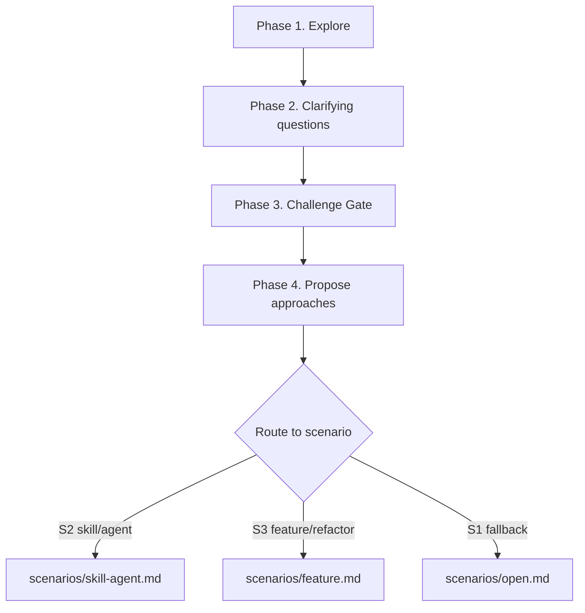

# Brainstorming: Methodology + Scenario Router

<!--
  Scenario files (load the one that matches):
    - scenarios/open.md          S1 open discussion (fallback)
    - scenarios/skill-agent.md   S2 skill / agent development
    - scenarios/feature.md       S3 feature / refactoring

  Cross-cutting references (load on demand):
    - references/challenge-gate.md         Challenge Gate rules
    - references/risk-and-spike.md         Risk Register & Spike Loop
    - references/document-writing.md       Writing conventions + templates
    - references/principles-library.md     Action principles library
    - references/skill-fundamentals.md     Skill identity criteria (S2)
    - references/agent-fundamentals.md     Agent identity criteria (S2)
    - references/design-patterns.md        Skill pattern catalog (S2)
    - assets/spec-document-reviewer-prompt.md       Spec review subagent prompt
-->

Turn ideas into complete designs through collaborative dialogue. This file is **methodology + router**. The detailed SOP lives in `scenarios/`.

<HARD-GATE>
Do NOT write code, scaffold a project, or take implementation action until the relevant scenario SOP has run and the user has approved the output. Fast mode (defined per scenario) exists for trivial tasks — it is not an excuse to skip brainstorming.
</HARD-GATE>

## Phase 0 — Scenario routing

Before anything else, determine which scenario applies:

- **S2** (skill/agent): user says "设计 skill / agent"、"新建 skill / agent"、"skill/agent brainstorm" — or the topic is clearly about designing a reusable capability / specialized role.
- **S3** (feature/refactoring): user says "开发 / 实现 / 加功能 / 新增 / 修复 / 重构 / 改造 X" — or the topic is clearly an implementation job.
- **S1** (open discussion): fallback for everything else — the user wants to think, explore, or align understanding with no immediate implementation intent.

Matching order: **try S2 → try S3 → fall back to S1**. When the trigger is ambiguous (e.g. "I want X to be better"), **ask the user** which scenario applies; do not silently default.

Once matched, the rest of this file is the common skeleton; scenario-specific steps live in `scenarios/<matched>.md` (those files use **Step N**; this file uses **Phase N** to avoid cross-file collision).

## Mode selection

Two cost branches exist within every scenario — pick before running the skeleton:

- **Normal mode** — default. Full skeleton + full scenario SOP. Use for any non-trivial design.
- **Fast mode** — compressed branch. SKILL.md's HARD-GATE still applies. Triggers and skip list live in each scenario file (S2 §Gotchas, S3 §Gotchas). Fast is **never** an excuse to skip brainstorming entirely; it is a lower-ceremony path for trivial scope.

If uncertain which mode applies, default to Normal and let the scenario's Fast trigger escalate downward.

## Common skeleton (all scenarios)

1. **Phase 1 — Explore project context** — files, recent commits, ecosystem relevant to the scenario.
2. **Phase 2 — Ask clarifying questions** — purpose / scope baseline; further questions are heuristic.
3. **Phase 3 — Challenge Gate** — strongest objection + 3 checks (see `references/challenge-gate.md`).
4. **Phase 4 — Propose approaches** — Normal: 2-3 options with trade-offs; Fast branch: direct recommendation.

### Clarifying questions: principle

- **purpose** (what is this really trying to solve?) and **scope** (what is in / out?) are the **only preset baseline**.
- All other questions must be **heuristic** — based on specific ambiguities / conflicts / risks you actually observed during Explore. Ask 1-3 targeted questions, not a checklist.
- **Never ask preset scenario-specific questions.** Preset checklists kill brainstorming's core capability. Scenario files tell you what to **look at** during Explore, not what to **ask**.

### Ordering notes

- **Propose approaches before Risk & Spike.** Risk applies to specific proposals; risk without proposals is abstract anxiety. Risk & Spike lives inside each scenario's SOP (S2/S3), not in this common skeleton.

## Key principles

- **One question at a time** — MUST NOT ask multiple clarifying questions in one turn.
- **Multiple choice first** — MUST offer enumerated choices when the answer space is bounded; open-ended only when genuinely open.
- **YAGNI ruthlessly** — MUST remove unrequested features from all designs.
- **Incremental validation** — scenarios MUST present design section-by-section; move to the next only after user approval.
- **Action principles are the scenario's to pick** — default set: TDD · Break-Don't-Bend · Zero-Context Entry. See `references/principles-library.md` for the catalog.

## Producer contract (S3 only)

S3's only deliverable is a design doc at `docs/brainstorming/specs/<YYYY-MM-DD>-<slug>.md`. brainstorming is its sole author; coding-orchestrator consumes it and generates the story skeleton on its own. Full detail in `scenarios/feature.md`.

## Failure handling

Explicit walk-off for each failure point; never silently proceed.

- **User refuses clarifying questions** — state which decisions are blocked, offer the smallest default you would otherwise infer, require explicit user OK before continuing.
- **Challenge Gate standoff** (user rejects the strongest objection without a refutation) — pause. Record the disagreement in the design doc as an open risk and ask the user to either refute the objection or narrow scope; do NOT push to Propose approaches.
- **Scenario routing ambiguous** (cannot pick S1 / S2 / S3) — MUST ask the user; never default silently.
- **Unresolved 🔴 risk after max spike time-boxes** — halt. Report which assumption is still open and recommend either (a) splitting the story or (b) treating the unknown as a known risk handed to the downstream consumer; do NOT finalize design.
- **Spec review loop exceeds 3 iterations** — stop iterating. Surface the outstanding blocking issues to the user and ask for a decision (accept as-is / redesign the contested section).
- **Fast mode triggered but 🔴 risk appears mid-design** — MUST escalate to Normal mode and rerun from Risk & Spike; Fast mode cannot absorb 🔴.
