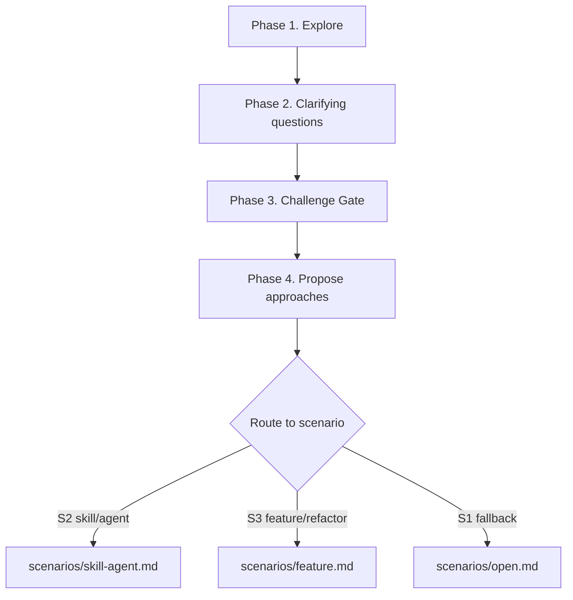

# Brainstorming

<!--
  Scenario files (load the one that matches):
    - scenarios/open.md          S1 open discussion (fallback)
    - scenarios/skill-agent.md   S2 skill / agent development
    - scenarios/feature.md       S3 feature / refactoring

  Cross-cutting references (load on demand):
    - references/challenge-gate.md         Challenge Gate rules
    - references/risk-and-spike.md         Risk Register & Spike Loop
    - references/document-writing.md       Writing conventions + templates
    - references/principles-library.md     Action principles library
    - references/skill-fundamentals.md     Skill identity criteria (S2)
    - references/agent-fundamentals.md     Agent identity criteria (S2)
    - references/design-patterns.md        Skill pattern catalog (S2)
    - assets/spec-document-reviewer-prompt.md       Spec review subagent prompt
-->

Run a design-before-implementation pipeline through collaborative dialogue. This file owns top-level routing, global guardrails, and the shared workflow skeleton. Scenario-specific SOP lives in `scenarios/`.

## Hard Gate

<HARD-GATE>
Do NOT write code, scaffold a project, or take implementation action until the relevant scenario SOP has run and the user has approved the output. Fast mode (defined per scenario) exists for trivial tasks — it is not an excuse to skip brainstorming.
</HARD-GATE>

## Key Principles

- **One question at a time** — Ask at most one clarifying question per turn.
- **Multiple choice first** — Use bounded choices whenever the answer space is known; use open-ended questions only when it is genuinely open.
- **YAGNI ruthlessly** — Do not carry unrequested features, abstractions, or scope into the design.
- **Validate incrementally** — Advance section by section; do not move forward until the current section is approved.
- **Choose principles intentionally** — Select action principles to fit the scenario; do not apply a default set mechanically. Default set: TDD · Break-Don't-Bend · Zero-Context Entry. See `references/principles-library.md` for the full library.

## Workflow

### Step 0. Route the scenario

Determine the scenario before doing anything else:

| Scenario | Trigger | Meaning |
|---|---|---|
| **S2** | User says "设计 skill / agent"、"新建 skill / agent"、"skill/agent brainstorm" | The topic is about designing a reusable capability or specialized role |
| **S3** | User says "开发 / 实现 / 加功能 / 新增 / 修复 / 重构 / 改造 X" | The topic is clearly an implementation job |
| **S1** | Fallback for everything else | The user wants to think, explore, or align understanding with no immediate implementation intent |

Matching order: **try S2 → try S3 → fall back to S1**. When the trigger is ambiguous (for example, "I want X to be better"), **ask the user** which scenario applies; do not default silently.

Once the scenario is matched, continue through the common skeleton in this file, then hand off to `scenarios/<matched>.md`.

### Step 1. Choose the mode

Choose the cost branch before running the skeleton:

| Mode | Trigger | Behavior |
|---|---|---|
| **Normal mode** | Default; use for any non-trivial design | Run the full skeleton + full scenario SOP |
| **Fast mode** | Trivial scope only; triggers and skip list live in each scenario file (S2 §Gotchas, S3 §Gotchas) | Use the compressed branch. `HARD-GATE` still applies. Fast is **never** an excuse to skip brainstorming entirely; it is a lower-ceremony path |

If uncertain which mode applies, default to Normal and let the scenario's Fast trigger escalate downward.

### Step 2. Run the common skeleton

#### Step 2.1 Explore

Inspect the project context relevant to the scenario: files, recent commits, and surrounding ecosystem.

#### Step 2.2 Clarify

Ask only the questions needed to make the next design move defensible.

| Question type | Rule |
|---|---|
| **Purpose** | Always allowed; baseline |
| **Scope** | Always allowed; baseline |
| **Other questions** | Must come from ambiguities, conflicts, or risks observed during Explore |

- Ask 1-3 targeted questions, not a checklist.
- Never ask preset scenario-specific questions. Scenario files tell you what to **look at** during Explore, not what to **ask**.

#### Step 2.3 Challenge

Run **Challenge Gate**: surface the strongest objection, then apply the three checks in `references/challenge-gate.md`.

#### Step 2.4 Propose

Present the proposal shape that should move the discussion forward.

| Mode | Proposal behavior |
|---|---|
| **Normal** | Present 2-3 options with trade-offs |
| **Fast** | Give a direct recommendation |

Risk follows proposals, not the other way around. Risk without a proposal is abstract anxiety. Risk & Spike runs inside the matched scenario SOP (`S2` / `S3`), not in this common skeleton.

### Step 3. Hand off to the scenario SOP

After the common skeleton, continue in the matched scenario SOP:

| Scenario | Continue in |
|---|---|
| **S1** | `scenarios/open.md` |
| **S2** | `scenarios/skill-agent.md` |
| **S3** | `scenarios/feature.md` |

### Step 4. Enforce output and stop conditions

#### Output contract

| Scenario | Deliverable | Notes |
|---|---|---|
| **S1** | No mandatory artifact | Optional discussion note only when the user explicitly asks to preserve conclusions, or the discussion reaches a reusable insight worth capturing |
| **S2** | Design-first output | The detailed contract for design docs, spec review, and optional skeleton production lives in `scenarios/skill-agent.md` |
| **S3** | Design doc only | Save to `docs/brainstorming/specs/<YYYY-MM-DD>-<slug>.md`; brainstorming writes nothing else |

#### Stop conditions

Stop explicitly at each failure point; never proceed silently.

| Condition | Required response |
|---|---|
| **User refuses clarifying questions** | State which decisions are blocked, offer the smallest default you would otherwise infer, require explicit user OK before continuing |
| **Challenge Gate standoff** | Pause. Record the disagreement in the design doc as an open risk and ask the user to either refute the objection or narrow scope; do NOT push to Propose approaches |
| **Scenario routing ambiguous** | MUST ask the user; never default silently |
| **Unresolved 🔴 risk after max spike time-boxes** | Halt. Report which assumption is still open and recommend either (a) splitting the story or (b) treating the unknown as a known risk handed to the downstream consumer; do NOT finalize design |
| **Spec review loop exceeds 3 iterations** | Stop iterating. Surface the outstanding blocking issues to the user and ask for a decision (accept as-is / redesign the contested section) |
| **Fast mode triggered but 🔴 risk appears mid-design** | MUST escalate to Normal mode and rerun from Risk & Spike; Fast mode cannot absorb 🔴 |
