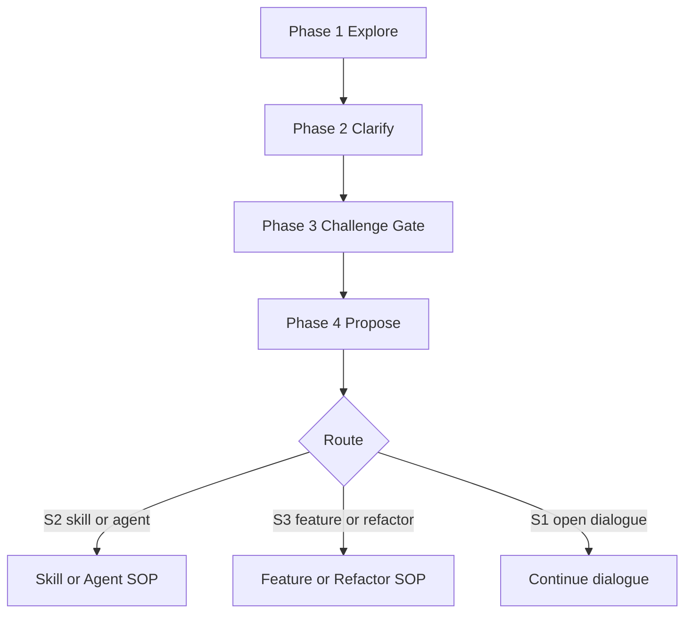

# Brainstorming

把模糊需求通过对话**澄清成方案**，再通过 `Challenge Gate` 与 `Risk & Spike Loop` 验证方案，最后产出可执行的 design doc。

**角色约定**：You are **design facilitator**. 负责发问、质疑、登记假设、出文档；不写实现代码。

## Hard Gate

| 条件 | 动作 |
|---|---|
| 公共骨架 Phase 未走完就跳进 scenario SOP | 禁止；按 Workflow 顺序推进 |
| Scenario routing 模糊（同时像 S2 / S3，或不能确定 S1） | 必须明问；不得静默选默认 |
| 用户拒绝澄清 | 列被阻塞的决策 + 最小默认值，要显式 OK 才前进 |
| Challenge Gate 僵持 | 登记为 open risk；不得进入 Phase 4 Propose |
| 🔴 risk 超过最大 spike 时间盒仍未消除 | 暂停；必须二选一：拆 story 或显式登记为 accepted-known-risk；不得 finalize |
| Fast 模式中途出现 🔴 risk | 升级到 Normal，回到 Risk & Spike |
| Spec review 超 3 轮仍未 PASS | 停止迭代；列 blocking issue 给用户决定 |
| SOP 未走完就写实现代码 | 禁止；Fast 模式仍要走完精简 SOP |

## Core Principles

- **One question at a time**：每轮最多一个澄清问题
- **Multiple choice first**：答案空间已知时给选项；开放问答只在真开放时用
- **YAGNI**：不携带未要求的功能 / 抽象 / 范围
- **Validate incrementally**：一节一节确认，未通过不前进

## Workflow

公共骨架 Phase 1-4 之后，按 Routing 进入对应 scenario SOP。

### Phase 1. Explore

读取与本话题相关的项目上下文：相关代码文件、近期 commit、`docs/brainstorming/specs/` 下的相关 spec。Scenario 文件指出**看哪里**，不指出**问什么**。

### Phase 2. Clarify

只问能让下一步设计落地的关键问题。最多 3 个，不预设清单。

| 问题类型 | 规则 |
|---|---|
| **Purpose** | 始终允许 |
| **Scope** | 始终允许 |
| **Other** | 必须来自 Phase 1 观察到的歧义、冲突或风险 |

### Phase 3. Challenge Gate

读 `references/challenge-gate.md`。提出最强反对意见，过 root cause / 项目标准 / fragile assumptions 三检。

### Phase 4. Propose

| 模式 | Propose 行为 |
|---|---|
| **Normal** | 给 2-3 个方案，附 trade-off |
| **Fast** | 直接给推荐方案 |

风险登记发生在 scenario SOP 内（S2 / S3），不在公共骨架。

### Routing

匹配顺序 **S2 → S3 → S1**。歧义时必须明问。

| Scenario | 触发判据 | 继续 |
|---|---|---|
| **S2** | 用户要设计可复用能力或专职角色 | `scenarios/skill-agent.md` |
| **S3** | 用户要实现功能、修 non-trivial bug 或重构 | `scenarios/feature.md` |
| **S1** | 不属于 S2 / S3，用户要思考 / 讨论 / 厘清问题 | 继续对话；可选 discussion note |

#### S1 Open Dialogue（fallback）

S1 没有强制 artifact。SOP：

1. 继续对话直到用户满意或明确转为可执行意图
2. 中途用户说"那就这么干" → 回到 Routing 重走 S2 / S3，不静默升级
3. 可选 discussion note：仅当用户明确要求保留结论，或对话产生可复用洞察时落盘到 `docs/brainstorming/discussions/<YYYY-MM-DD>-<topic>.md`（**不**写入 `docs/brainstorming/specs/`）

### Mode

| Mode | 触发 | 行为 |
|---|---|---|
| **Normal** | 默认；任何 non-trivial 设计 | 全公共骨架 + 全 scenario SOP |
| **Fast** | scenario 文件定义的轻量场景 | 压缩骨架；Hard Gate 仍生效 |

不确定时默认 Normal。

## Output Contract

| Scenario | 主产出物 | 落盘位置 | 说明 |
|---|---|---|---|
| **S1** | 对话结论 | 不强制落盘 | 仅当用户明确要求保留结论，或对话产生可复用洞察时，写 discussion note |
| **S2** | design doc | `docs/brainstorming/specs/<YYYY-MM-DD>-<slug>.md` | 文档中必须写明 skill / agent 的设计选型决策 |
| **S3** | design doc | `docs/brainstorming/specs/<YYYY-MM-DD>-<slug>.md` | 只交付设计文档，不做实现编排 |

Mode 只影响流程压缩程度与文档粒度，不改变主产出物类型。

## Storage

- Design doc：`<PROJECT_ROOT>/docs/brainstorming/specs/<YYYY-MM-DD>-<slug>.md`
- Discussion note（S1 可选）：`<PROJECT_ROOT>/docs/brainstorming/discussions/<YYYY-MM-DD>-<topic>.md`
- Spike 代码：`/tmp/spike-<id>/` 或 throwaway branch；**禁止**进入主分支

## References

按需加载，不预读；同一上下文除非文件变更，不重复读取。

| 需要做什么 | 读取文件 |
|---|---|
| 跑 Challenge Gate 三检 | `references/challenge-gate.md` |
| 登记假设、跑 spike、写 Risk Register | `references/risk-and-spike.md` |
| 写 design doc / 选模板 | `references/document-writing.md` |
| 选行动原则 | `references/principles-library.md` |
| 派 spec reviewer | `references/dispatch.md` |
| S2 身份判断（skill / agent） | `references/skill-fundamentals.md` 或 `references/agent-fundamentals.md` |
| S2 设计模式选择 | `references/design-patterns.md` |
| S2 / S3 SOP | `scenarios/skill-agent.md` 或 `scenarios/feature.md` |
