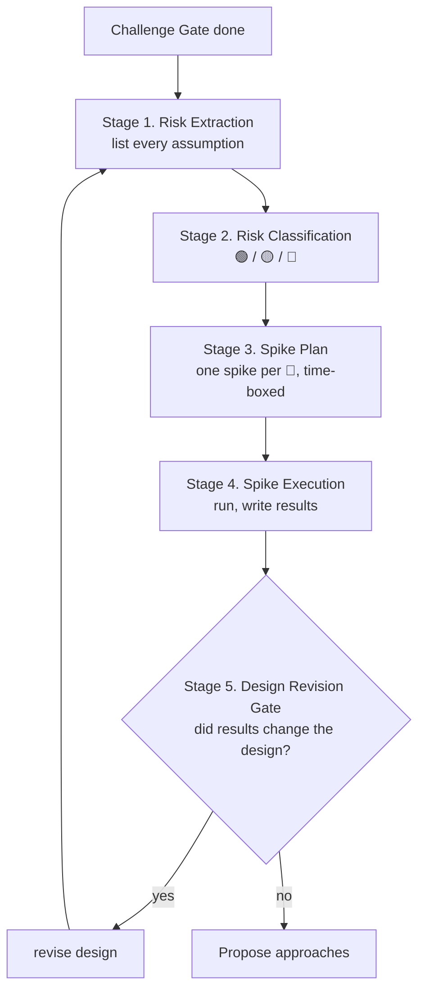

# Risk Register & Spike Loop

This step runs **after Challenge Gate, before Propose approaches**. Its purpose is to identify which design assumptions can only be answered by running code, then run minimal throwaway code to answer them — **before** committing to a design that bets on unknowns.

Without this step, lifecycle / framework-integration / cross-module bugs only surface during E2E acceptance, costing 3-5x the time to fix because the architecture is already built around the wrong assumption.

## Why this exists

Brainstorming and orchestrator can both write perfect plans inside the bubble of "what we assume is true." Bugs born from **wrong assumptions** are invisible to both — they only show up when the running system contradicts the design. Spike retires those assumptions cheaply.

Real-world signal: any story whose verification phase needs more than 2 fix rounds usually means an unvalidated architectural assumption is leaking through every task. Spike kills it at the source.

## Workflow



Stages 1-5 run inside brainstorming. The spike code never enters the main branch. (Named **Stage** to avoid collision with scenario **Step N** and SKILL.md **Phase N**.)

## Stage 1: Risk Extraction

For every major design decision, ask three questions:

1. **What behavior am I betting on?** (one sentence, falsifiable)
2. **How do I know this behavior is correct?** (experience / docs / running code)
3. **If wrong, what's the blast radius?** (one component / one module / whole story)

Record each bet as a row in the Risk Register. Aim for 5-15 entries on a non-trivial story; fewer than 3 means you haven't thought hard enough.

**Common assumption families to probe**:

| Family | Example |
|--------|---------|
| Lifecycle | "Provider 在 sibling page 切换时存活" |
| Framework quirks | "Next.js dynamic route param 自动 URL-decode" |
| State persistence | "Zustand store 在 router.push 后保留" |
| Cross-module wiring | "新增 store API 会被组件自然消费" |
| Race / concurrency | "URL 同步与用户点击不会双触发" |
| Native widget behavior | "受控 textarea 在 mount 间切换时 value 行为" |
| Data shape contracts | "API 返回字段始终包含 X" |
| Browser/runtime quirks | "localStorage 在隐身模式可写" |

If a story doesn't touch any of these families, it probably doesn't need spikes — Risk Register may stay 🟢/🟡 only.

## Stage 2: Risk Classification

| 类别 | 判据 | 处理 |
|------|------|------|
| 🟢 **Trivial** | 经验/文档直接答；blast radius 小 | 跳过，不入 Spike Plan |
| 🟡 **Doc-verifiable** | 30 分钟内读源码/官方文档可答 | 读完，把答案写进 Risk Register；不入 Spike Plan |
| 🔴 **Spike-required** | 只有跑代码才知道行为 OR blast radius 大且经验不足 | **必须**进入 Spike Plan |

**Hard rule**: 🔴 risks block design finalization. You may not finish brainstorming with unresolved 🔴 entries.

**Sizing guard**:
- 0 个 🔴 → spike 阶段 skip，但 Risk Register 仍写入文档（留作后续审查证据）
- 1-3 个 🔴 → 正常 spike loop
- 4+ 个 🔴 → story 范围/认知欠债太大，停下报用户，建议拆 story 或先做技术调研

## Stage 3: Spike Plan

For each 🔴 risk, write a Spike entry:

| 字段 | 内容 |
|------|------|
| **ID** | S1, S2, ... |
| **Question** | 一句话写清要回答的 yes/no 或行为问题 |
| **Verification approach** | 写代码骨架，3-10 行内表达验证思路 |
| **Time box** | 10min / 30min / 60min（最多 2h，超过应拆分） |
| **Success criterion** | 跑完后能不能写出 "答案是 X" 的一句话；否则 spike 失败 |
| **Storage** | 临时路径，例：`/tmp/spike-S1/` 或 throwaway branch；**禁止**进入 main |

**Anti-patterns**:
- ❌ Spike 写超过 50 行 → 问题没拆细，回去重新分解
- ❌ Spike "顺便" 实现一部分功能 → 违反 throwaway 原则，停下重写
- ❌ Spike 答案是 "看起来能用" / "应该可以" → 不是 yes/no，没结束
- ❌ Spike 代码 commit 到主分支 → 永远禁止

## Stage 4: Spike Execution

执行 Spike 时遵守：

1. **一次只跑一个 spike**：避免互相干扰
2. **严格时间盒**：超时即停，结果记为 "未消除"，明示给后续阶段
3. **结果必须落字**：每个 spike 跑完，向 Spike Results section 回填一行：
   ```
   - S1: ✅ Provider unmount → store 销毁；必须 hoist 到 layout
   - S2: ✅ params 不自动 decode；冒号 %3A 原样传入
   - S3: ❌ 时间盒超出，未得出结论 → 升级为 risk 传给 orchestrator
   ```
4. **跑完即删**：spike 代码立即丢弃（rm -rf 或 branch 删除）

## Stage 5: Design Revision Gate

Spike 结果回填后，重读 Risk Register + 设计方案，回答：

- 有任何 🔴 spike 结果与原设计冲突吗？
- 如果有 → **必须**修改设计方案，再回到 Stage 1（重新 extract risks，因为修改可能引入新 bet）
- 如果没有 → 进入 Propose approaches

**Hard rule**: 不允许 "spike 结果不利但设计不改" — 这等于浪费 spike 投入，且把已知 bug 留给实现阶段。

## Risk Register Template

写入设计文档（`design-doc-template-normal.md` 已含此 section）：

```markdown
## 假设与风险登记（Assumptions & Risks）

| # | 假设/赌注 | 类别 | 错了的代价 | 处理 |
|---|----------|------|-----------|------|
| A1 | <一句话写清楚行为假设> | 🔴 / 🟡 / 🟢 | <blast radius> | Spike S1 / 读文档 / 跳过 |
| A2 | ... | ... | ... | ... |
```

## Spike Plan Template

```markdown
## Spike 计划（Spike Plan）

| Spike | Question | Verification | Time box | Storage |
|-------|----------|--------------|----------|---------|
| S1 | <yes/no 问题> | <3-10 行代码骨架描述> | 15min | /tmp/spike-S1/ |
| S2 | ... | ... | 30min | ... |
```

## Spike Results Template

```markdown
## Spike 结果（Spike Results）

填写格式：`- S<id>: <✅/❌> <一句话答案> → <对设计的影响>`

- S1: ✅ Provider 在 page.tsx 切换时 unmount，store 销毁 → **设计修订**：Provider hoist 到 layout.tsx
- S2: ✅ params 不自动 decode → **设计修订**：所有 useParams 经 safeDecode wrapper
- S3: 🟡 部分得出结论，时间盒到 → 余下未知传给 orchestrator 作为 known risk
```

## Fast 模式

Fast 模式下（单文件、明确无歧义任务）：

- Risk Extraction 仍然做，但允许只列 1-3 条
- 类别只关心 🔴 / 非 🔴；不区分 🟢/🟡
- 0 个 🔴 → skip Spike Plan / Spike Results section
- ≥ 1 个 🔴 → 升级为 Normal mode，不允许 Fast mode 跳过 spike

理由：Fast mode 的前提是"行为已知"，出现 🔴 等于前提不成立。

## 与 Challenge Gate 的关系

- Challenge Gate 质疑 **方向**（你在解错的问题吗？）
- Risk Register 质疑 **假设**（你赌的行为对吗？）

两者顺序不能颠倒：先确认方向对，再为方向中的假设买保险。Challenge Gate 通过的方案，仍可能因为假设错而崩塌——Spike Loop 是这层防御。
