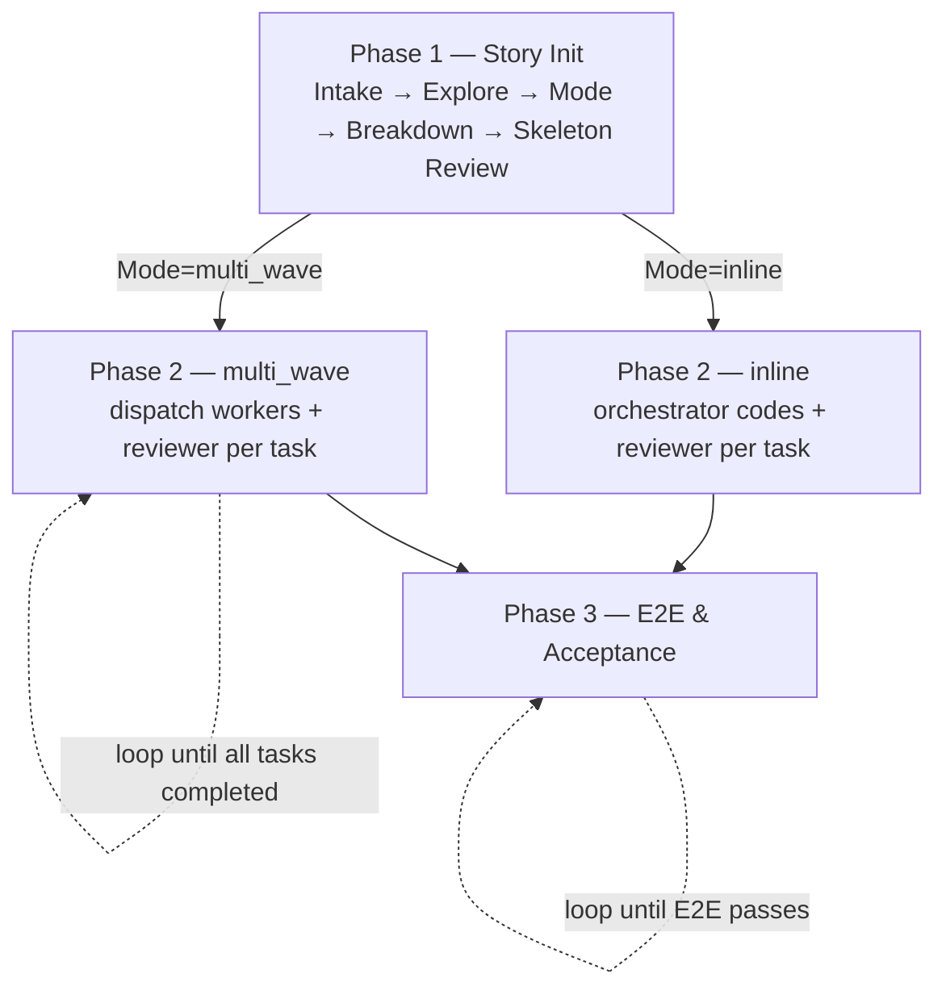

# Coding Orchestrator: Spec-Driven Sub-Agent Orchestration

## Hard Gate

<HARD-GATE>
Behavior is mode-dependent. Mode is chosen in Phase 1 step 3 and recorded at
the top of `story.md`.

**multi_wave** — orchestrator does NOT write implementation or test code.
Delegate all coding, design, testing, and debugging to sub-agents. Orchestrator
edits only control-plane artifacts: `tasks.yaml`, `.handoff-context`, task
specs, review prompts, `story-memory.md`, `story.md`.

**inline** — orchestrator MAY write implementation and test code itself within
a single wave. Reviewer sub-agent MUST still be dispatched for every task —
review is never inlined.
</HARD-GATE>

## Agents

Local agents; paths relative to the skill root. Dispatch pattern: read the
agent file (body = protocol), pass it as system context in your dispatch
call; your task-specific input is the prompt.

| Agent | Path | Role |
|---|---|---|
| code-reviewer | agents/code-reviewer.md | Review implementation vs spec; cannot modify files |
| task-skeleton-reviewer | agents/task-skeleton-reviewer.md | Audit task skeleton for merge/split/rewave; cannot modify files |

## Pipeline

Steps describe actions. Document reads marked **[MANDATORY]** must be read before proceeding; everything else is on-demand (see References).



### Phase 1 — Story Initialization

1. **Story Intake** — initialize the story. **[MANDATORY]** Read `references/storage-layout.md` and `references/story-intake.md` first.
2. **Cheap Exploration** — before breakdown, append a `## Exploration` section to `story.md` with three terse bullet lists. Use Grep/Glob directly; do NOT dispatch sub-agents:
   - **Files** — paths this story will touch
   - **Call chain** — key function calls across those files (guards against orphaned wiring — Rule 2)
   - **Data flow** — data structures + direction of flow (flags schema changes)
3. **Mode Decision** — choose execution mode based on Exploration. Record at the top of `story.md` as `Mode: inline` or `Mode: multi_wave`:
   - **inline** (default) — orchestrator completes the work in one wave, writing code itself
   - **multi_wave** — trigger only when Files > 10 **AND** estimated LOC > 1000
   Thresholds are initial picks; adjust after real runs. Do not encode them as CLI or schema.
4. **Task Breakdown** — decompose into a task skeleton; wave ≥ 2 leave `spec: null`. **[MANDATORY]** Read `references/task-decomposition-rules.md` first.
5. **Skeleton Review Gate** (mandatory, both modes) — dispatch `task-skeleton-reviewer` (see Agents). Read the agent file for the protocol, then pass prompt `Audit skeleton at stories/<slug>/tasks.yaml. Spec: <spec path>`. Apply the returned JSON (merge / split / rewave); orchestrator owns the final decision.

### Phase 2 — Wave Execution

Loop until every task reaches `status: completed`.

1. **Write JIT Spec** for this wave before dispatching.
2. **Execute** — Mode=multi_wave: dispatch coding tasks (native sub-agent or tmux). Mode=inline: orchestrator writes code directly; skip dispatch.
3. **Checkpoint** — after each material state change:
   - **Capture usage first** on every sub-agent return (worker in multi_wave; reviewer in both modes). Read the `<usage>` block at the tail of the agent payload (`input_tokens + output_tokens`, `tool_use` count, wall-clock duration). Run:
     `omp coding-orchestrator task update --story-dir <PROJECT_ROOT>/stories --story <slug> --id <NN> --usage-kind <worker|reviewer> --model <name> --tokens <input+output> --tool-uses <N> --duration-ms <N>`
     If the agent was interrupted before emitting usage, log the gap in `story-memory.md` so it stays auditable.
   - **Then update handoff**:
     `omp coding-orchestrator handoff update --story-dir <PROJECT_ROOT>/stories --story <slug> --task-id <NN> --phase <executing|reviewing|accepting|advancing> --next-action "<...>"`
4. **Review** — generate the task context fragment:
   `omp coding-orchestrator review create --story-dir <PROJECT_ROOT>/stories --story <slug> --task-id <NN> [--additional <str>]`
   Dispatch `code-reviewer` with `<protocol body>\n\n<task context>` as the prompt. Apply orchestrator second judgment; workers make all code changes.
5. **Test & Debug** — run tests. On failure, escalate via the Test & Debug protocol. Orchestrator decides escalation; workers execute the fix.
6. **Accept Task** — verify must-haves; mark passing tasks `completed`.
7. **Feedback & Revise** — promote reusable findings into `story-memory.md`.
8. **Advance Wave** — when every current-wave task is `completed`, flip each next-wave task to `executing`:
   `omp coding-orchestrator task update --story-dir <PROJECT_ROOT>/stories --story <slug> --id <NN> --status executing`
9. **Report & Repeat** — report wave status, then loop back to step 1:
   ```
   Wave N: X/Y completed — task-NN [status], task-MM [status]
   Next: <one-sentence next action>
   ```

### Phase 3 — E2E Testing & Acceptance

1. **E2E Test** — run the E2E tests defined in task specs.
2. **Debug & Fix** — on failure, escalate via the Test & Debug protocol.
3. **Rerun E2E** — repeat until passing.
4. **Acceptance** — verify must-haves per task spec.

## References

Consult these files only when their trigger fires. Do not preload; do not re-read within the same context unless the file may have changed.

| When you need to... | Read |
|---|---|
| Dispatch a worker/reviewer, route by capability, or handle test-failure escalation | `references/dispatch-routes.md` |
| Write `.handoff-context` or recover from compaction | `references/handoff-guideline.md` |
| Verify a task's must-haves before marking completed | `references/acceptance.md` |
| Decide what to promote into `story-memory.md` | `references/story-memory-guideline.md` |
| Dispatch via tmux to an external runtime | `references/commands.md` |
| Populate a spec's `Worker Refs` for sub-agents (principles they must apply) | `references/constitution.md` |

## Recovery & Storage

- **Storage**: `stories/` lives at `<PROJECT_ROOT>/stories/<YYYY-MM-DD>-<slug>/`.
- **Compaction recovery**: on resume, read `<PROJECT_ROOT>/stories/<YYYY-MM-DD>-<slug>/.handoff-context`. Trust `next_action` as the first recovery signal.
