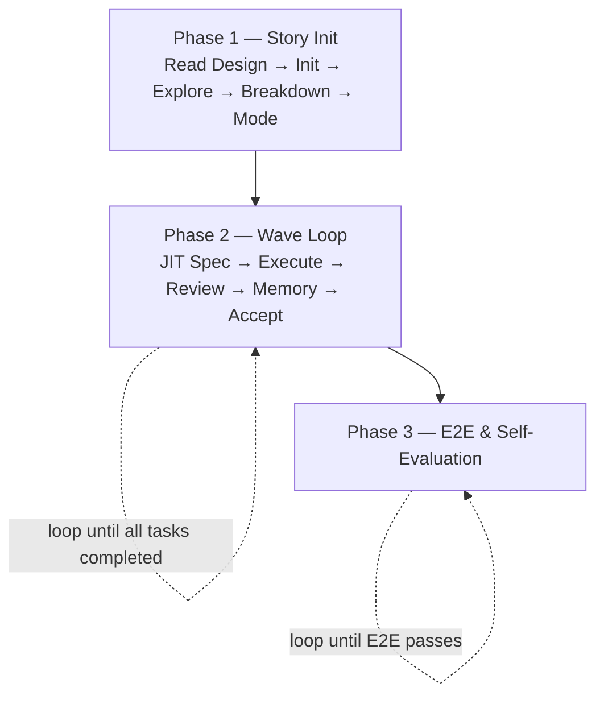

# Coding Supervisor: From Design to Code

基于设计文档创建工作任务，并进行编排和监督，直到完成实现、测试、验收的闭环。

## Hard Gate

- 没有设计文档 → 立即终止，提示用户先用 brainstorming skill。
- task `spec` 字段为 null/空 → 不得 dispatch worker 或开始编码（CLI 强制）。
- Review 必须派 reviewer sub-agent，inline 与 multi_wave 都强制，不得内联自审。

## Modes

| 模式 | 触发条件 | 编码者 | Reviewer | Story Memory |
|---|---|---|---|---|
| **inline**（默认） | 影响文件 ≤ 10 **或** 修改 ≤ 1000 LOC | Orchestrator 自己 | 强制派遣 sub-agent | 每 task 后更新 |
| **multi_wave** | 影响文件 > 10 **且** 修改 > 1000 LOC | Worker sub-agent | 强制派遣 sub-agent | 每 task 后更新 |

阈值是经验值。Phase 3 Self-Evaluation 会回顾是否换模式更优，按真实数据逐步调整。

## Agents

| Agent | Path | Role |
|---|---|---|
| code-reviewer | `agents/code-reviewer.md` | Review implementation vs spec; cannot modify files |

**派遣合同**：agent 文件正文 = system context（protocol）；`task.md` 内容 + 本轮 diff = prompt。

## Workflow



### Phase 1 — Story Initialization

1. **Read Design Document** — 读 `docs/brainstorming/specs/<YYYY-MM-DD>-<slug>.md`。无设计 → 终止。
2. **Story Init** —
   ```bash
   omp coding-supervisor archive --story-dir <PROJECT_ROOT>/stories
   omp coding-supervisor story init \
     --story-dir <PROJECT_ROOT>/stories \
     --slug <slug> --date <YYYY-MM-DD> \
     --design-doc /docs/brainstorming/specs/<YYYY-MM-DD>-<slug>.md
   ```
   生成 `story.md`、`tasks.yaml`、`story-memory.md`、空 `tasks/`。
3. **Fill story.md Goal / Context / Scope** — 从设计文档提取。
4. **Explore** — 内联使用 Grep/Glob，**不**派遣 sub-agent。把结果写入 `story.md ## Explore Result` 表格（文件 / 函数 / LOC 估算）；表尾汇总 `files=<N>, est_loc=<N>` 供 Mode Decision 使用。
5. **Task Breakdown（仅骨架）** — 在 `tasks.yaml` 写入每个 task 的 `id / title / wave / depends_on / files_modified / test_layer`。**不创建 task-NN.md，spec 字段保持 null**。规则见 `references/task-decomposition.md`。
6. **Mode Decision** — 按上面 Modes 表决定，并把 `Mode: inline` 或 `Mode: multi_wave` 写在 `story.md` 标题下方。

### Phase 2 — Wave Loop

每个 wave 重复以下步骤，直到所有 task `status: completed`。

1. **Read story-memory.md** — 写 spec 前必读，吸收前序 wave 的 Patterns / Gotchas / 已知误报。
2. **Write JIT Spec** — 为当前 wave 的每个 task，把 skill 内的模板 `skills/coding-supervisor/templates/task.md` 复制到 `<PROJECT_ROOT>/stories/<YYYY-MM-DD>-<slug>/tasks/task-NN.md`，填写 Objective / Protocol / Acceptance Checklist 三段，然后:
   ```bash
   omp coding-supervisor task update --story-dir <PROJECT_ROOT>/stories \
     --story <slug> --id <NN> --status executing
   ```
   （CLI 校验 `spec` 已写入才允许 `executing`；status 翻转时自动记 `started` 时间。）
3. **Execute**:
   - **inline**：supervisor 直接编辑代码，按 Acceptance Checklist 自检。
   - **multi_wave**：派遣 worker sub-agent。task.md 即合同；**File Scope / Read First / 项目规范**通过派遣 prompt 动态拼接，不写进 task.md。外部 runtime 见 `references/commands.md`。
4. **Review**（两模式强制）— 派遣 reviewer sub-agent。Prompt = `<protocol body>\n\n<task.md 内容>\n\n<diff>`。reviewer 不修改文件，由 supervisor 决定是否回环修复，回环也走同一个 task。
5. **Update story-memory.md** — 把跨 task 可复用的发现追加到 Patterns / Gotchas / Known False Positives。规则见 `references/story-memory-guideline.md`。
6. **Accept Task** — 逐项验证 task.md 的 Acceptance Checklist。通过后:
   ```bash
   omp coding-supervisor task update --story-dir <PROJECT_ROOT>/stories \
     --story <slug> --id <NN> --status completed
   ```
   （`completed` 时间自动写入。）
7. **Advance Wave** — 当前 wave 全部 `completed` 后回到步骤 1 进入下一 wave；下一 wave 各 task 必须先由 step 2 写入 spec，才能翻到 `executing`。

### Phase 3 — E2E & Self-Evaluation

1. **E2E Test** — 跑设计文档要求的端到端验证。失败 → 回 Phase 2 新建 fix task 修复。
2. **Self-Evaluation** — supervisor 自评，写入 `<PROJECT_ROOT>/stories/<YYYY-MM-DD>-<slug>/story-summary.md`。模板和评分项见 `references/self-evaluation.md`。

## References

按需加载，不预读；同一上下文内除非文件可能变更，不重复读。

| When you need to... | Read |
|---|---|
| Break story into tasks or write JIT spec | `references/task-decomposition.md` |
| Decide what to promote into `story-memory.md` | `references/story-memory-guideline.md` |
| Dispatch worker via tmux to external runtime (multi_wave) | `references/commands.md` |
| Write self-evaluation at story close | `references/self-evaluation.md` |

## Storage

`stories/` 必须位于**目标项目根目录**（`git rev-parse --show-toplevel`），不在 skill repo、不在 cwd。无法解析时停下问用户。新项目首次使用时确认 `stories/` 已加入 `.gitignore`。

布局：

```
<PROJECT_ROOT>/stories/
├── archives/                       # 由 archive 子命令自动归档（见 Phase 1 step 2）
└── <YYYY-MM-DD>-<slug>/            # active story
    ├── story.md                    # narrative + Mode + Explore Result
    ├── story-memory.md             # cross-task digest
    ├── story-summary.md            # Phase 3 self-evaluation（story 关闭时写入）
    ├── tasks.yaml                  # task state SSOT
    └── tasks/
        └── task-NN.md              # JIT spec：Objective / Protocol / Acceptance Checklist
```
