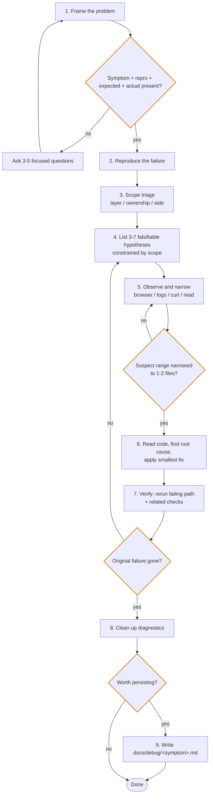

# Debug Issues

Use this skill when behavior is wrong and the next step is investigation.

<HARD-GATE>
Do NOT guess, rewrite broadly, or "try a few fixes" before collecting evidence.
Do NOT read code before the suspect range is narrowed to 1-2 files.
Do NOT skip Phase 1 framing when symptom / repro / expected / actual is incomplete.
</HARD-GATE>

## Workflow



Three feedback loops: re-frame when info still missing, re-observe when range stays wide, re-hypothesize when verification fails.

## Observation Methods

Pick by **environment** + **suspect range**:

| Method | Use when | Avoid when |
|---|---|---|
| **chrome-devtools** | Browser: console, network, DOM / CSS, SPA, runtime values | Non-browser scenarios |
| **curl direct probe** | Verify upstream HTTP service; isolate frontend / proxy / SDK layers | Pure compute or stateful pipelines |
| **Add logs** | Backend / CLI / long pipeline; async, concurrent, cross-process | Browser; range already tiny |
| **Read code** | Suspect range is 1-2 files (gate-locked); pure logic; config / typo; small recent diff | Range still wide; runtime-dependent; concurrency |

Decision order:

```text
browser?               -> chrome-devtools
upstream HTTP suspect? -> curl direct probe (mind proxy env)
narrow + pure logic?   -> read code
otherwise              -> add diagnostic logs
```

## Loading Guide

Load only what the current phase needs.

| Reference | Use when |
|---|---|
| `references/frame-problem.md` | Phase 1: bug report missing repro / expected / actual / env |
| `references/scope-triage.md` | Phase 3: deciding suspect layer, ownership, and side |
| `references/debugging-guideline.md` | Phase 4-7: hypotheses, observation, narrowing, fix, verify, cleanup |
| `references/coding-guideline.md` | Before editing code so the fix stays simple, surgical, goal-driven |
| `references/persist-playbook.md` | Phase 9: structure for `docs/debug/<symptom>.md` |

## Boundaries

- This skill covers debugging and root-cause analysis only.
- This skill does not do task orchestration, story breakdown, or agent routing.
- This skill does not justify speculative refactors or unrelated cleanup.
