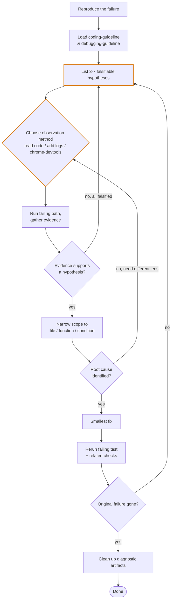

# Debug Issues

Use this skill when behavior is wrong and the next step is investigation, not
feature work.

<HARD-GATE>
Do NOT guess, rewrite broadly, or "try a few fixes" before collecting
evidence. Reproducible debugging starts with observation.
</HARD-GATE>

## Workflow

Debugging is not a straight line. The flow below has three feedback loops:
re-form hypotheses when evidence falsifies them, re-pick the observation
method when the current lens is too coarse, and re-enter the loop when the
fix fails verification.



## Observation Methods

Pick by **environment** + **suspect range**:

| Method | Use when | Avoid when |
|---|---|---|
| **Read code** | Range already narrow (short stack, error pinpoints line); pure logic / pure function; config / type / typo error; small recent change | Depends on runtime values; concurrency / timing; spread across many modules with no entry point |
| **Add logs** | Backend / CLI / long pipeline; async, concurrent, cross-process; rerunnable but not steppable; need to compare multiple runs | Browser UI / DOM / network bugs; range already 1-2 functions; throwaway script |
| **chrome-devtools** | Browser / frontend: network failures, console errors, DOM / CSS state, SPA routing, frontend performance, JS runtime values | Non-browser scenarios; headless backend; CLI |

Decision order:

```text
Is the failure in a browser page?
  yes -> chrome-devtools (list_console_messages, list_network_requests,
                          evaluate_script, take_snapshot ...)
  no  -> Is the suspect range already 1-2 functions of pure logic?
         yes -> read code
         no  -> add diagnostic logs
```

## Loading Guide

Load only what you need:

- `references/coding-guideline.md`
  Use before editing code so the fix stays simple, surgical, and goal-driven.

- `references/debugging-guideline.md`
  Use when a test fails, runtime behavior is wrong, or the cause is unclear.

## Boundaries

- This skill is for debugging and root-cause analysis.
- This skill does not do task orchestration, story breakdown, or agent routing.
- This skill does not justify speculative refactors or unrelated cleanup.
