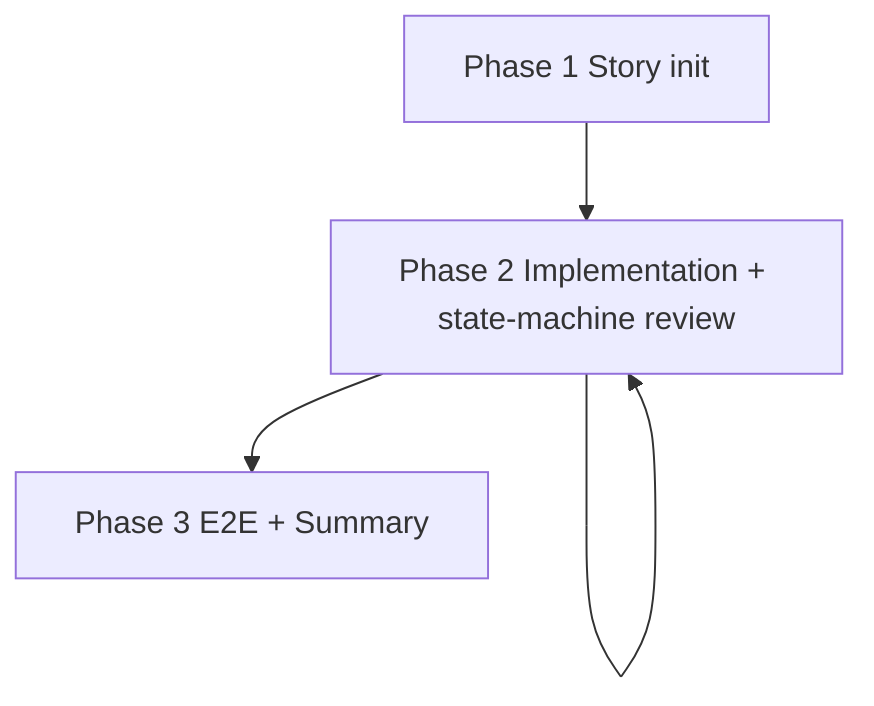

# Kickoff

Carry a clarified requirement to shipped code. Drive review with a task state machine. Survive `/compact` by writing journal entries at every task boundary.

## Role

You are the **developer**. Implement, commit, maintain `journal.md`, and advance task state. Dispatch a **reviewer** to push `done` tasks to `reviewed`. Dispatch a sub-agent only for narrow, read-only exploration.

Reviewer dispatch:

- Default: sub-agent (`agents/code-reviewer.md`)
- Fallback: cross-runtime tmux to codex (see `references/commands.md`)

## Hard Gate

| Condition | Action |
|---|---|
| Goal / Out of Scope / Task plan unclear | Stop. Ask the user to clarify. |
| Entering Phase 3 with any task ∉ {reviewed, dropped} | Block. |
| Task jumps from `in_progress` to `reviewed` (skips `done`) | Block. |
| Task declared complete without review | Block. |
| `in_progress` task missing any of the four evidence fields (`assumption / verify / fact / edit target`) | Block edits. |
| Reviewer self-evaluates inside the developer's main context | Forbidden. Use a sub-agent or tmux. |
| Reviewer returns `NEEDS_FIX` three times in a row without `PASS` | Stop. Hand the report and current diff to the user. |
| Reviewer returns `BLOCKED` | Resolve the blocker (missing context / spec gap), then redispatch. |
| E2E test fails | Fix and re-run. Never declare done with a failing E2E. |
| `omp kickoff` subcommand exits non-zero | Read stderr and act. Do not swallow the error. |

## Core Principles

- **The story is the smallest state container.** Persist cross-session facts under `<PROJECT_ROOT>/stories/<YYYY-MM-DD>-<slug>/`. `story.md` (static contract) and `journal.md` (event log) are the source of truth. **When chat memory disagrees with the file, the file wins** — base every decision on `omp kickoff status` or a journal grep, never on "I remember".
- **Persist state continuously, not only at the end.** Write the four evidence fields + `decision / gotcha / diff` at every task boundary. Do not rely on a pre-`/compact` recap. After `/compact`, run `omp kickoff status` first, then read `story.md` and the tail of `journal.md`.
- **Cross review.** The author does not review; the reviewer does not write. Run every review in an isolated context (sub-agent or cross-runtime tmux).
- **Let the state machine drive review timing.** The developer chooses when to dispatch — one task or a batch. The only invariant: every task is `reviewed` or `dropped` before Phase 3.
- **Real-system E2E gates completion.** Verify on real machines, real gateways, real providers. Mock-green does not count as done.
- **Surface friction immediately.** When you find prior defects, contradictory rules, or scope drift, tell the user. Do not patch silently. Do not work around.

## Task State Machine

```
planned ─┬─→ in_progress ─┬─→ done ─┬─→ reviewed (terminal)
         │                │         │
         │                │         └─→ needs_fix ─→ done (loop)
         │                │
         └────────────────┴─→ dropped (terminal)
```

The seven legal transitions, evidence rules, and current-state query rule live in `references/state-machine.md`. `omp kickoff status` flags any bypass (e.g., `planned → reviewed`, `in_progress → reviewed`) as an illegal transition and blocks Phase 3.

## Workflow



Cross-session resume: run `omp kickoff status` → read `story.md` → read the tail of `journal.md` → continue the active `in_progress` task.

### Phase 1. Initialize the story

Goal: persist the requirement as a static contract.

1. Archive stale stories:
   ```bash
   omp kickoff archive --story-dir <PROJECT_ROOT>/stories
   ```
2. Create the new story:
   ```bash
   omp kickoff story init \
     --story-dir <PROJECT_ROOT>/stories \
     --slug <slug> --date <YYYY-MM-DD> [--design-doc <path>]
   ```
3. Fill `story.md`: Goal / Scope (In/Out) / References / Required reading / Test environment / Redlines / Task plan. The skeleton renders from `templates/story.md`; replace each HTML-comment placeholder.
4. Leave `journal.md` empty. The skeleton (`templates/journal.md`) carries field documentation. Append entries during Phase 2.

**Done when**

- [ ] Stale stories moved to `archives/` (if any)
- [ ] New story dir contains `story.md` and `journal.md`
- [ ] `story.md` has Goal, Out of Scope, Required reading, and Task plan filled

### Phase 2. Implementation + state-machine review loop

Goal: write code, commit, advance every task to `reviewed` or `dropped`. The developer chooses review timing.

For each task:

1. Enter `[in_progress]`. Write the four evidence fields (`assumption / verify / fact / edit target`) in `journal.md`. **Do not edit code until all four are filled.**
2. Implement and commit.
3. Enter `[done]`. Write `decision / gotcha / diff` in `journal.md`.
4. Advance to `[reviewed]` (one task or batched) by dispatching a reviewer.
   - `PASS` → `reviewed`.
   - `NEEDS_FIX` → `needs_fix`. Fix, commit, return to `done`, redispatch.
   - `BLOCKED` → resolve the blocker, then redispatch.

Run `omp kickoff status` at any time to check current state, evidence completeness, open issues, and Phase 3 readiness.

Load on demand:

- Task state semantics, evidence rules, legal transitions: `references/state-machine.md`
- Journal entry fields, append rules, grep patterns: `references/journal-protocol.md`
- Reviewer dispatch, verdict handling: `references/review.md`
- Cross-runtime tmux dispatch (codex / pi): `references/commands.md`

**Done when** (check once before Phase 3)

- [ ] Every task is `reviewed` or `dropped`
- [ ] `omp kickoff status` reports `Phase 3 ready: YES`
- [ ] Every open ISSUE is handled (fixed / dismissed / promoted to a task)

### Phase 3. E2E gate + summary

Goal: verify on real systems, sync surrounding docs, write the summary.

1. Run E2E on real machine, real gateway, real provider. Reject mock-green.
2. On failure: fix, re-run; reopen Phase 2 with new tasks if needed.
3. Sync surrounding docs touched by this story: architecture, README, backlog.
4. Fill the four sub-sections of `## Summary` (the skeleton is already in `story.md`):
   - **Outcome.** What shipped, commit range, key decisions.
   - **Friction.** What slowed the kickoff (estimation drift, process friction, tooling blockers).
   - **Open items.** Follow-ups for next time (fix tasks, scope creep, debt registry, unresolved ISSUEs).
   - **Promotion candidates.** Concrete kickoff / CLAUDE.md / project rule changes worth promoting. Write "none" if there are none.

**Done when**

- [ ] E2E passes on real systems
- [ ] Affected architecture docs / README / backlog updated
- [ ] All four sub-sections of `## Summary` filled

## Storage

`stories/` must live at the target project root (`git rev-parse --show-toplevel`). Never write it inside the skill repo or the current `cwd`. Stop and ask the user when the project root cannot be resolved. The first time you onboard a project, confirm `stories/` is in `.gitignore`.

```text
<PROJECT_ROOT>/stories/
├── archives/
└── <YYYY-MM-DD>-<slug>/
    ├── story.md     # Static contract: Goal / Scope / Required reading / Test env / Redlines / Task plan / Summary (skeleton at init, filled at Phase 3)
    └── journal.md   # Event log: append-only TASK / ISSUE entries in time order
```

For legacy stories (containing `story-memory.md` / `story-summary.md` / `tasks.yaml`), run `omp kickoff archive`. Do not migrate.

## CLI Reference

| Command | Description |
|---|---|
| `omp kickoff archive --story-dir <root> [--threshold-days N] [--dry-run]` | Archive stale or legacy stories |
| `omp kickoff story init --story-dir <root> --slug <slug> [--date YYYY-MM-DD] [--design-doc <path>] [--force]` | Create a story directory with `story.md` + `journal.md` skeleton |
| `omp kickoff status --story-dir <root> [--story <slug or YYYY-MM-DD-slug>]` | Report current state: tasks, evidence completeness, open ISSUEs, Phase 3 readiness |

## References

Load on demand. Within a single context, do not re-read unless the file may have changed.

| Task | File |
|---|---|
| Understand task states, legal transitions, evidence rules | `references/state-machine.md` |
| Write a journal entry, query current state, find grep patterns | `references/journal-protocol.md` |
| Dispatch reviewer, interpret verdict, handle `NEEDS_FIX` vs `BLOCKED` | `references/review.md` |
| Cross-runtime tmux dispatch (codex / pi) for review | `references/commands.md` |
