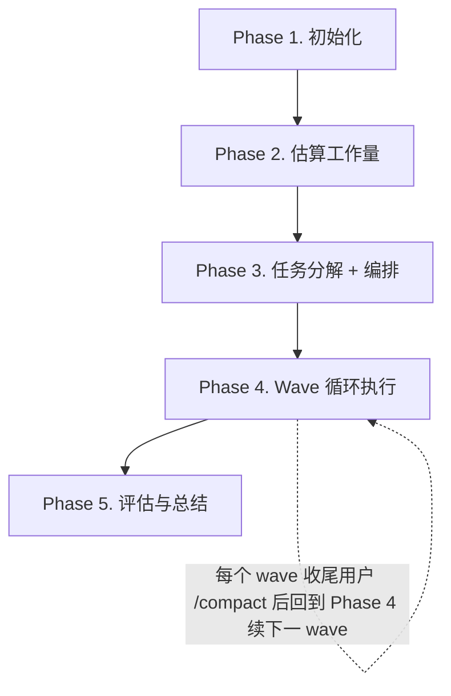

# Kickoff

把已澄清的用户需求转成可工作的代码。Story 是叙事单位，Wave 是上下文单位（每 wave ≤500 LOC 走完一轮 spec→code→review→memory 循环），Task 是执行单位。

## Hard Gate

| 条件 | 处理 |
|---|---|
| 需求未澄清（Goal / Context / Scope 不清） | 立即终止，请用户先把需求说清楚再回来。kickoff 不替你澄清 |
| `tasks.yaml` 中目标 task 的 `spec` 字段为 null/空 | 不得 dispatch 任何执行者；CLI 已强制（`omp kickoff task update --status executing` 会拒绝） |
| Review 在主上下文里自评 | 禁止；review 必须 sub-agent 或 tmux 隔离上下文执行（`references/review.md`） |
| 单个 wave 估算 LOC 累计 > 500 | 必须切刀；保护单上下文窗口预算 |

## Failure Handling

对入口前置以外的过程失败，不得静默吞掉或盲目重试：

| 失败场景 | 动作 |
|---|---|
| `omp kickoff` 任一子命令退出码非零 | 读 stderr → 按错误信息处理；不要忽略后继续走 |
| archive 目标已存在（destination exists） | skip 并向用户汇报冲突 story 名，由用户决定保留 / 改名 / 删除 |
| Sub-agent 超时 / 报错返回 | 单次重试；再次失败则 fall back 到 inline 完成（探索/调试场景）或停下让用户介入（review 场景，不得自评） |
| Review verdict = `NEEDS_FIX`，连续 3 次回环仍未 PASS | 停下，把 review 报告 + 当前 diff 提给用户判断（继续修 / 接受为已知缺陷 / 拆 fix task / 退回 spec 修订） |
| Review verdict = `BLOCKED` | 读 reviewer notes，先解决 reviewer 提的 blocker（spec 不清 / 缺 context），再 re-dispatch；不要无视 BLOCKED 强行 PASS |
| E2E 测试失败 | 建 fix task 加入下一 wave 的队尾；不要在当前 wave 内尝试无序修复 |
| Sub-agent completion report 字段不全（status / changes / deviations / next-task-hint / story-memory-impact 缺失） | 视为 `needs-kickoff`，要求重发或转 inline 完成 |
| `tasks.yaml` 解析失败 / SSOT 损坏 | 立即停下报告用户，不得自动重写文件 |

## Philosophy

1. **Story 是单一真相**：所有讨论与决策落在 `<PROJECT_ROOT>/stories/<YYYY-MM-DD>-<slug>/` 下的文档；文档与对话冲突，以文档为准。
2. **JIT Spec**：spec 在 wave 开始时基于最新上下文写，不预先写死整个 story 的所有 task spec。
3. **Wave = 上下文窗口**：每 wave ≤500 LOC，走完才让用户 `/compact`；新会话从 `tasks.yaml` 的 `waves[]` 末项续接，kickoff 只负责把状态写齐，不负责自动恢复。
4. **跨 task 记忆**：用 `story-memory.md` 沉淀 Patterns / Gotchas / Known False Positives；每个 task 收尾追加，下一 wave 开头读取。
5. **Cross Review**：编写者不评，评审者不写。
6. **发现即反馈**：开发中发现历史代码缺陷（设计 / 模式 / 逻辑 / 死代码 / 文档），立即向用户反馈，不要静默修复或绕开。

## Execution Mode

为每个**任务**（不是每个 wave）按"上下文污染风险"决定执行方式：

| Mode | 何时触发 | 典型任务 |
|---|---|---|
| **Inline** | 默认；产物需要进主上下文继续推理 | 编码、单元/集成测试编写、JIT spec 撰写、story.md 撰写、阈值以下的小范围探索、修复 review 反馈 |
| **Sub Agent** | 产物是 verdict / 摘要，或会污染主上下文 | 项目探索超阈值、第三方库调研、代码评审、复杂调试、E2E 失败分析 |
| **Tmux** | 需要非 Claude runtime 或用户指定 | 用 Codex / Pi 编码或评审 |

判定算法、探索阈值预判、调试 sub-agent 产物契约、tmux 派遣命令见 `references/execution.md`。

## Workflow



### Phase 1. 初始化

1. 归档过期 story：`omp kickoff archive --story-dir <PROJECT_ROOT>/stories`
2. 创建新 story 骨架：

   ```bash
   omp kickoff story init \
     --story-dir <PROJECT_ROOT>/stories \
     --slug <slug> --date <YYYY-MM-DD>
   ```

   生成 `story.md` / `tasks.yaml` / `story-memory.md` / 空 `tasks/`。

   带真实值的示例（在 `/home/me/myrepo` 项目下创建 `add-login` story）：

   ```bash
   omp kickoff story init \
     --story-dir /home/me/myrepo/stories \
     --slug add-login --date 2026-04-24
   # → /home/me/myrepo/stories/2026-04-24-add-login/
   ```

3. 填写 `story.md` 的 Goal / Context / Scope（从用户对话中提取；如有需求文档则附上路径）。

**验收**：
- [ ] 旧 story 已迁入 `archives/`
- [ ] 新 story 目录与骨架文件已建立
- [ ] `story.md` 的 Goal / Context / Scope 三段均已填写

### Phase 2. 估算工作量

探索代码库中受影响文件，结果写入 `story.md` 的 `## Explore Result` 表格。**只估代码改动行数**，**不估工作时长**。

探索的预判算法（先 cheap grep 估算命中再决定 inline / sub-agent）和阈值定义见 `references/execution.md` 的 `## 探索阈值的预判算法` 段。

模板：

| 编号 | 改动的文件名 | 预估代码改动行数 |
|:--|:--|:--|
| 01 | xx.ts | +20 |

**验收**：
- [ ] Explore Result 表格已完成
- [ ] 表尾汇总 `files=<N>, est_loc=<N>` 已填写
- [ ] 估算表格已提交用户确认

### Phase 3. 任务分解 + 编排

**目标**：写 `tasks.yaml` 任务骨架（id / title / wave / depends_on / files_modified / est_loc / test_layer），spec 字段保持 null。**不得**写 `tasks/task-NN.md` 细节，那留给 Phase 4 的 wave 开头 JIT 撰写。

分解规则（详见 `references/task-decomposition.md`）：
- Rule 1（Test Layer Match）：每个 task 的 `test_layer` 设为可证伪 acceptance 的最高层（默认 e2e）
- Rule 2（No Orphan API）：新增共享 API 必须与首个 consumer 在同一 task 内
- Rule 3（Vertical Slice）：单 task 触及文件 ≤5；超额则垂直切（按 feature），不要水平切（按 layer）

编排算法：
1. 按 `depends_on` 拓扑排序，得到执行顺序
2. 沿顺序累加 `est_loc`，**累计 ≤500 行打包成同一 wave**；越过 500 即开新 wave
3. 单 task `est_loc > 500` 独占一个 wave（不要为塞进预算而拆开 vertical slice）

**验收**：
- [ ] `tasks.yaml` 所有 task 状态为 `pending`，`spec: null`
- [ ] 每个 task 都标注了 `wave` / `depends_on` / `est_loc` / `test_layer`
- [ ] Wave 切分通过 `references/task-decomposition.md` 末尾的 self-check
- [ ] **不存在** `tasks/task-NN.md` 文件（spec JIT 撰写）

### Phase 4. Wave 循环执行

按照 `references/execution.md` 的 wave workflow 执行，直到 `tasks.yaml` 中所有 task 状态为 `completed`。

每个 wave 的关键步骤（执行细节见 execution.md）：
1. 强制读 `story-memory.md`
2. 为本 wave 各 task 写 JIT Spec（`tasks/task-NN.md`），把 spec 字段写入 tasks.yaml
3. 顺序执行各 task：决策 Mode → `task update --status executing --worker <id>` → 执行 → review（独立上下文）→ 修复回环 → `task update --status completed --reviewer <id> --commit <sha>`
4. 每个 task 收尾追加 `story-memory.md`
5. **本 wave 全部 completed 后，必须**：
   ```bash
   omp kickoff task wave-update \
     --story-dir <PROJECT_ROOT>/stories --story <slug> --number <N> \
     --key-decision "..." --open-question "..." --next-focus "..."
   ```
6. 向用户汇报本 wave 状态，提示用户 `/compact` 进入新会话再触发 kickoff 续 wave

**验收**（每个 wave 末检查）：
- [ ] 本 wave 所有 task 状态为 `completed`，每个 task 的 `reviewer` 和 `commits` 字段非空
- [ ] `story-memory.md` 至少有一项追加
- [ ] `tasks.yaml` 的 `waves[]` 已追加本 wave 的快照（key_decisions / open_questions / next_focus 至少有一项非空）

### Phase 5. 评估与总结

1. **E2E 验证**：跑设计/需求要求的端到端验证。失败 → 回 Phase 4 建 fix task 修复后再继续。
2. **写 Self-Evaluation**：按 `references/self-evaluation.md` 模板写入 `<story-dir>/story-summary.md`（含 §6 矛盾条款）。
3. **更新外围文档**：受影响的架构文档 / README / Backlog 同步更新。
4. **向用户汇报**：列出本 story 的 wave 数 / task 数、关键决策、未决项、Self-Evaluation 中标红的负面机制（让用户决定是否调整 skill 或 CLAUDE.md）。

**验收**：
- [ ] 所有 task 状态为 `completed`
- [ ] E2E 验证通过
- [ ] `story-summary.md` 已写，§6 矛盾条款已回答（即使是"无"）
- [ ] 受影响的架构文档 / README / Backlog 均已更新

## Storage

`stories/` 必须位于**目标项目根目录**（`git rev-parse --show-toplevel`），不在 skill repo、不在 cwd。无法解析时停下问用户。新项目首次使用确认 `stories/` 已加入 `.gitignore`。

布局：

```
<PROJECT_ROOT>/stories/
├── archives/                       # 由 omp kickoff archive 自动归档
└── <YYYY-MM-DD>-<slug>/            # active story
    ├── story.md                    # narrative + Goal / Context / Scope / Explore Result
    ├── story-memory.md             # cross-task digest（Patterns / Gotchas / Known False Positives）
    ├── story-summary.md            # Phase 5 self-evaluation（story 关闭时写入）
    ├── tasks.yaml                  # 任务状态 + waves[] 快照（SSOT）
    └── tasks/
        └── task-NN.md              # JIT spec：Objective / Protocol / Acceptance Checklist
```

## CLI 速查

| Command | Description |
|---|---|
| `omp kickoff archive --story-dir <root> [--threshold-days N] [--dry-run]` | 归档 stale / legacy story |
| `omp kickoff story init --story-dir <root> --slug <slug> [--date YYYY-MM-DD] [--design-doc <path>] [--force]` | 创建 story 目录与骨架文件 |
| `omp kickoff task update --story-dir <root> --story <slug> --id <NN> [--status ...] [--worker ...] [--reviewer ...] [--commit <sha>] [--note <text>]` | 更新单个 task 字段（自动维护 started / completed / story-level updated） |
| `omp kickoff task show --story-dir <root> --story <slug> [--id <NN>]` | 列任务表 / 看单 task |
| `omp kickoff task wave-update --story-dir <root> --story <slug> --number <N> [--key-decision ...] [--open-question ...] [--next-focus ...]` | wave 收尾追加快照（重复 --number 即替换） |

## References

按需加载，不预读；同一上下文内除非文件可能变更，不重复读。

| When you need to... | Read |
|---|---|
| 决定具体 Mode、写 sub-agent prompt、跑 wave 循环 | `references/execution.md` |
| 派 reviewer 或解释 review verdict | `references/review.md` |
| 拆分任务 / 写 JIT spec | `references/task-decomposition.md` |
| 决定哪些经验进 story-memory.md | `references/story-memory-guideline.md` |
| 用 tmux 派外部 runtime（Codex / Pi） | `references/commands.md` |
| Phase 5 写 story-summary.md | `references/self-evaluation.md` |
