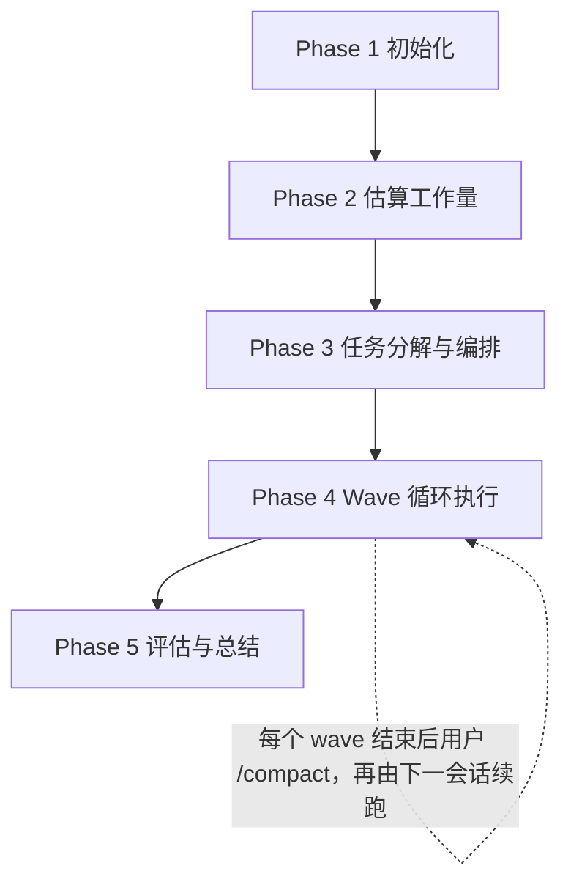

# Kickoff

把**已澄清**的需求推进到可工作的代码。

**角色约定**：You are **orchestrator** —— 负责拆解、派发、审查回环、状态落盘。

- **Story** = 叙事与状态容器
- **Wave** = 上下文窗口单位
- **Task** = 执行单位

**约束**：
- 单个 wave 估算代码改动累计 **<= 500 LOC**
- 每个 wave 都走完一轮 `spec -> code -> review -> memory`
- review 必须隔离上下文执行，不得自评

## Hard Gate

| 条件 | 动作 |
|---|---|
| 需求未澄清（Goal / Context / Scope 不清） | 立即停止。先让用户澄清；kickoff skill 不负责澄清需求 |
| `tasks.yaml` 中目标 task 的 `spec` 为 null/空 | 不得 dispatch 执行者；CLI 已强制拒绝 `status=executing` |
| review 试图在主上下文里自评 | 禁止；review 必须用 sub-agent 或 tmux 隔离执行 |
| 单个 wave 估算 LOC 累计 > 500 | 必须切 wave；不要突破上下文预算 |

## Failure Handling

入口之后的失败不能静默吞掉，也不能盲目重试。

| 失败场景 | 动作 |
|---|---|
| `omp kickoff` 任一子命令退出码非零 | 读取 stderr，按错误处理；不要忽略后继续 |
| archive 目标已存在（destination exists） | skip，并向用户报告冲突的 story 名；由用户决定保留 / 改名 / 删除 |
| Sub-agent 超时 / 报错 | 允许单次重试；再次失败时：探索/调试可退回 inline，review 必须停下让用户介入 |
| Review verdict = `NEEDS_FIX`，连续 3 次回环仍未 PASS | 停下，把 review 报告和当前 diff 提给用户，让用户决定继续修 / 接受缺陷 / 拆 fix task / 回退 spec |
| Review verdict = `BLOCKED` | 先处理 reviewer 的 blocker（缺 context / spec 不清），再重新 dispatch；不要无视 BLOCKED 强行推进 |
| E2E 测试失败 | 建 fix task 放到下一 wave 队尾；不要在当前 wave 内无序修补 |
| Sub-agent completion report 字段不全（`status / changes / deviations / next-task-hint / story-memory-impact`） | 视为 `needs-orchestrator`，要求重发或转 inline 完成 |
| `tasks.yaml` 解析失败 / SSOT 损坏 | 立即停下并报告用户；不得自动重写文件 |

## Core Principles

1. **Story 是单一真相**：所有决策与状态都落在 `<PROJECT_ROOT>/stories/<YYYY-MM-DD>-<slug>/`；文档与对话冲突时，以文档为准。
2. **JIT Spec**：task spec 在所属 wave 开头、基于最新上下文编写；不要一次性预写整条 story。
3. **Wave = 上下文窗口**：每个 wave 只承载可控改动量；完成后再让用户 `/compact`。
4. **跨 task 记忆**：`story-memory.md` 记录可复用模式、坑点、review false positive。
5. **Cross Review**：编写者不评，评审者不写。
6. **发现即反馈**：发现历史缺陷时立即告诉用户，不要静默修复或绕开。

## Execution Mode

每个**task**单独决定执行方式，不按 wave 一刀切。

| Mode | 何时使用 | 典型任务 |
|---|---|---|
| **Inline** | 默认；产物需要进入主上下文继续推理 | 编码、写测试、写 JIT spec、写 `story.md`、小范围探索、修复 review 反馈 |
| **Sub Agent** | 产物主要是 verdict / 摘要，或原始材料会污染主上下文 | 超阈值探索、第三方调研、代码评审、复杂调试、E2E 失败分析 |
| **Tmux** | 需要不同 runtime，或当前 runtime 没有原生 sub-agent | 用 Codex / Pi 执行编码或评审 |

具体判定算法、探索阈值、sub-agent 产物契约、tmux 派遣命令见 `references/execution.md`。

## Workflow



### Phase 1. 初始化

目标：建立 story 骨架，并把需求落盘成 Story 事实源。

1. 归档过期 story：
   ```bash
   omp kickoff archive --story-dir <PROJECT_ROOT>/stories
   ```
2. 创建新 story：
   ```bash
   omp kickoff story init \
     --story-dir <PROJECT_ROOT>/stories \
     --slug <slug> --date <YYYY-MM-DD>
   ```
   产出：`story.md` / `tasks.yaml` / `story-memory.md` / 空 `tasks/`。
3. 填写 `story.md` 的 `Goal / Context / Scope`。

真实示例：

```bash
omp kickoff story init \
  --story-dir /home/me/myrepo/stories \
  --slug add-login --date 2026-04-24
# -> /home/me/myrepo/stories/2026-04-24-add-login/
```

**验收**
- [ ] 旧 story 已迁入 `archives/`
- [ ] 新 story 目录与骨架文件已建立
- [ ] `story.md` 的 `Goal / Context / Scope` 三段均已填写

### Phase 2. 估算工作量

目标：只估**代码改动规模**，不估时间。

- 探索受影响文件
- 结果写入 `story.md` 的 `## Explore Result`
- 表尾写汇总：`files=<N>, est_loc=<N>`

模板：

| 编号 | 改动的文件名 | 预估代码改动行数 |
|:--|:--|:--|
| 01 | xx.ts | +20 |

探索阈值预判算法见 `references/execution.md` 的 `## 探索阈值的预判算法`。

**验收**
- [ ] `Explore Result` 表格已完成
- [ ] 表尾汇总 `files=<N>, est_loc=<N>` 已填写
- [ ] 估算结果已提交用户确认

### Phase 3. 任务分解与编排

目标：只写 `tasks.yaml` 骨架；此时 `spec` 必须保持 `null`。

必须填写的字段：
- `id`
- `title`
- `wave`
- `depends_on`
- `files_modified`
- `est_loc`
- `test_layer`
- `spec: null`

此阶段**不得**创建 `tasks/task-NN.md`。JIT spec 留到 Phase 4。

分解规则见 `references/task-decomposition.md`，其中三条硬规则是：
- Rule 1: Test Layer Match
- Rule 2: No Orphan API
- Rule 3: Vertical Slice

编排算法：
1. 按 `depends_on` 做拓扑排序
2. 沿执行顺序累计 `est_loc`
3. 累计 **<= 500** 时放进同一 wave
4. 超过 500 就开新 wave
5. 单 task `est_loc > 500` 时独占一个 wave

**验收**
- [ ] `tasks.yaml` 所有 task 状态均为 `pending`，且 `spec: null`
- [ ] 每个 task 都有 `wave / depends_on / est_loc / test_layer`
- [ ] wave 切分通过 `references/task-decomposition.md` 末尾的 self-check
- [ ] 不存在 `tasks/task-NN.md`

### Phase 4. Wave 循环执行

目标：逐 wave 执行，直到 `tasks.yaml` 中全部 task 为 `completed`。

**粒度**：review 与 commit 都是 wave-scope——一个 wave 一次 review、一次 commit，不是每个 task 一次。

每个 wave 固定顺序：

1. 强制读取 `story-memory.md`
2. 为本 wave 各 task 写 JIT spec：`tasks/task-NN.md`
3. 对本 wave 内每个 task 顺序执行（循环）：
   - 决策执行 mode
   - `task update --status executing --worker <id>`
   - 执行 task（编码 + 自检）
   - `task update --status completed`
   - 追加本 task 的跨 task 发现到 `story-memory.md`
4. 本 wave 所有 task 都 `completed` 后，做**一次** wave-scope review（sub-agent 或 tmux；diff 覆盖本 wave 全部 task 的 `files_modified` 并集）
5. 修复回环（inline 可跨 task 改）直到 verdict = `PASS`
6. 做**一次** git commit，一次性覆盖本 wave 全部改动
7. 写入 `waves[]` 快照（reviewer + commit 记录在这里）：

```bash
omp kickoff task wave-update \
  --story-dir <PROJECT_ROOT>/stories --story <slug> --number <N> \
  --reviewer "<agent-id-or-tmux-runtime>" \
  --commit "<sha>" \
  --key-decision "..." --open-question "..." --next-focus "..."
```

8. 向用户汇报，并提示 `/compact` 后进入下一 wave

完整细节见 `references/execution.md`；review 协议见 `references/review.md`。

**验收**
- [ ] 本 wave 所有 task 状态均为 `completed`
- [ ] `tasks.yaml` 的 `waves[]` 末项 `reviewer` 与 `commit` 字段非空
- [ ] `story-memory.md` 至少追加一项
- [ ] `waves[]` 末项 `key_decisions / open_questions / next_focus` 至少一项非空

### Phase 5. 评估与总结

1. 跑 E2E 验证；失败则回 Phase 4 建 fix task
2. 按 `references/self-evaluation.md` 写 `<story-dir>/story-summary.md`
3. 同步外围文档：架构文档 / README / Backlog
4. 向用户汇报：wave 数、task 数、关键决策、未决项、Self-Evaluation 中的负面机制

**验收**
- [ ] 所有 task 状态均为 `completed`
- [ ] E2E 验证通过
- [ ] `story-summary.md` 已完成，且 §6 已回答
- [ ] 受影响的架构文档 / README / Backlog 已更新

## Storage

`stories/` 必须位于**目标项目根目录**（`git rev-parse --show-toplevel`），不能放在 skill repo，也不能放在当前 cwd。无法解析项目根时，停下问用户。首次接入新项目时，确认 `stories/` 已加入 `.gitignore`。

目录结构：

```text
<PROJECT_ROOT>/stories/
├── archives/
└── <YYYY-MM-DD>-<slug>/
    ├── story.md
    ├── story-memory.md
    ├── story-summary.md
    ├── tasks.yaml
    └── tasks/
        └── task-NN.md
```

文件职责：
- `story.md`: narrative + Goal / Context / Scope / Explore Result
- `story-memory.md`: 跨 task digest
- `story-summary.md`: Phase 5 自评结果
- `tasks.yaml`: 任务状态与 `waves[]` 快照的 SSOT
- `tasks/task-NN.md`: 每 task 的 JIT spec

## CLI 速查

| Command | Description |
|---|---|
| `omp kickoff archive --story-dir <root> [--threshold-days N] [--dry-run]` | 归档 stale / legacy story |
| `omp kickoff story init --story-dir <root> --slug <slug> [--date YYYY-MM-DD] [--design-doc <path>] [--force]` | 创建 story 目录与骨架文件 |
| `omp kickoff task update --story-dir <root> --story <slug> --id <NN> [--status ...] [--worker ...] [--note <text>]` | 更新单个 task 状态字段；自动维护 started / completed / story-level updated。**reviewer 和 commit 是 wave-scope，走 wave-update** |
| `omp kickoff task show --story-dir <root> --story <slug> [--id <NN>]` | 查看全部 task 或单 task |
| `omp kickoff task wave-update --story-dir <root> --story <slug> --number <N> [--reviewer ...] [--commit <sha>] [--key-decision ...] [--open-question ...] [--next-focus ...]` | 追加或替换 wave 快照（含本 wave 的 reviewer + commit） |

## References

按需加载，不预读；同一上下文内除非文件可能变更，不重复读取。

| 需要做什么 | 读取文件 |
|---|---|
| 决定 mode、写 sub-agent prompt、跑 wave loop | `references/execution.md` |
| 派 reviewer、解释 review verdict | `references/review.md` |
| 拆 task、写 JIT spec | `references/task-decomposition.md` |
| 判断哪些经验该进入 `story-memory.md` | `references/story-memory-guideline.md` |
| 用 tmux 派外部 runtime（Codex / Pi） | `references/commands.md` |
| Phase 5 写 `story-summary.md` | `references/self-evaluation.md` |
