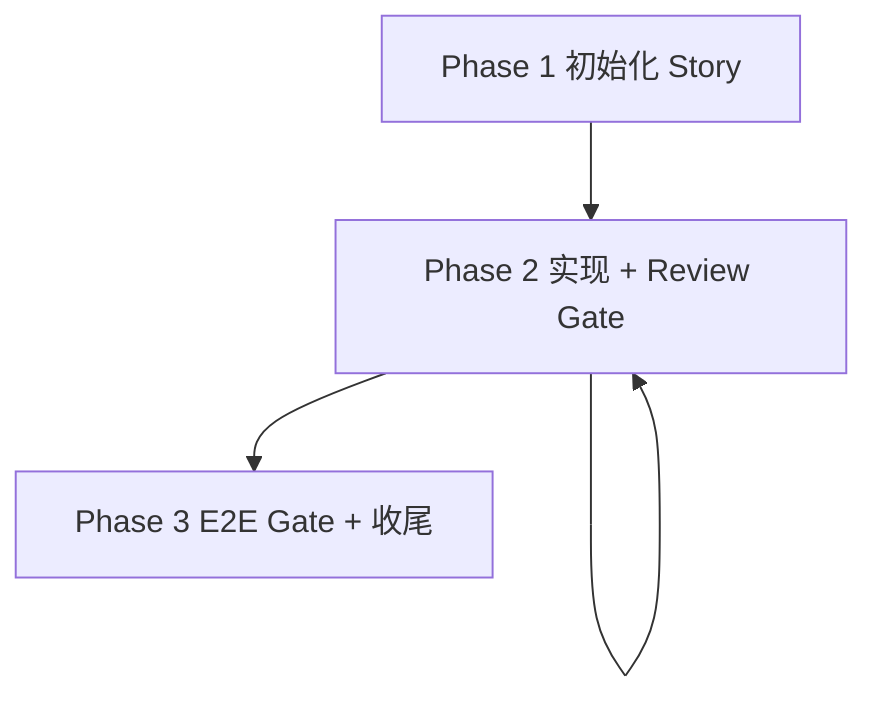

# Kickoff

把**已澄清**的需求推进到上线。通过`Cross Review` 和 `E2E Gate` 确保质量。通过`story-memory.md` 让经验跨 commit、跨 session 复用。

**角色约定**：You are **orchestrator**. 你负责执行、接受独立评审、维护 story 记忆。

## Hard Gate

| 条件 | 动作 |
|---|---|
| 需求未澄清（Goal / Context / Scope 不清） | 立即停下，让用户先澄清 |
| 进入 Phase 3，但仍有未 review 的 commit | 禁止；先在 Phase 2 把所有 commit 走 review pass |
| 准备声明"完成"，但未跑真机 E2E | 禁止声明完成；必须真机端到端验证通过 |
| Reviewer 试图在主上下文里自评 | 禁止；review 必须用 sub-agent 或 tmux 隔离执行 |
| Review verdict = `NEEDS_FIX` 连续 3 次仍未 PASS | 停下，把 review 报告 + 当前 diff 提给用户决定 |
| Review verdict = `BLOCKED` | 先处理 reviewer 的 blocker（缺 context / spec 不清），再重新派 |
| E2E 测试失败 | 修复并重跑；不得带着 E2E 失败声明完成 |
| `omp kickoff` 子命令退出码非零 | 读取 stderr 处理；不要静默吞错继续 |

## Core Principles

- **Story 是最小状态容器**：跨 session 的事实落在 `<PROJECT_ROOT>/stories/<YYYY-MM-DD>-<slug>/`。 `story.md`、`story-memory.md`、`story-summary.md` 是核心文档。文档与对话冲突时，以文档为准。
- **Cross Review**：编写者不评，评审者不写。Review 必须在独立上下文执行。
- **E2E 是完成门槛**：声明完成前必须真机端到端验证，不接受 mock 绿灯。
- **发现即反馈**：发现历史缺陷、流程矛盾、潜在 scope 偏移时，立即告诉用户；不要静默修复，不要绕开。

## Workflow



**注意**：

1. Story 跨 session 时，新会话开始立即读 `story-memory.md`
2. 所有 commit 必须 review 通过后才进入 Phase 3

### Phase 1. 初始化 Story

目标：建立 story 骨架，把需求落盘成事实源。

1. 归档过期 story：
   ```bash
   omp kickoff archive --story-dir <PROJECT_ROOT>/stories
   ```
2. 创建新 story：
   ```bash
   omp kickoff story init \
     --story-dir <PROJECT_ROOT>/stories \
     --slug <slug> --date <YYYY-MM-DD>
   ```
3. 填写 `story.md` 的 `Goal / Context / Scope`。

真实示例：

```bash
omp kickoff story init \
  --story-dir /home/me/myrepo/stories \
  --slug add-login --date 2026-04-25
# -> /home/me/myrepo/stories/2026-04-25-add-login/
```

**验收**

- [ ] 旧 story 已迁入 `archives/`
- [ ] 新 story 目录与骨架文件已建立
- [ ] `story.md` 的 `Goal / Context / Scope` 三段已填写

### Phase 2. 实现 + Review Gate

目标：写代码，commit，过 review，循环到 story 全部代码完成。节奏由 orchestrator 控制——可以一次完成，也可以拆多个 commit。

**Review 规则**：

- 所有进入 Phase 3 的 commit 必须经过 review
- 一次 review 可覆盖多个 commit，单次范围 ≤ **10 个 commit / 500 行 diff**
- review 不通过的改动用新 commit 修复后再次 review；不要 revert 已 commit

每个 commit：

1. 跑项目自测（单测 / typecheck / lint 等项目约定的 command）
2. 创建 commit

每个 review 单元（自上次 review pass 以来的全部 commit）：

1. 派独立 reviewer：
   - 优先跨工具 Review：claude -> openai，codex -> claude。参考 `references/commands.md`，使用 tmux 派遣Codex / Pi / Claude 执行 code review。
   - 跨工具 Review 失败时，派遣 sub-agent —— `agents/code-reviewer.md`
2. 处理 verdict（失败上限与升级条件见 Hard Gate）：
   - `PASS` → 把本轮关键决策、坑点、review false positive 追加到 `story-memory.md`
   - `NEEDS_FIX` → 用新 commit 修复 → 重新 review
   - `BLOCKED` → 处理 blocker → 重新 dispatch

按需加载：

- review verdict 与 reviewer 输入：`references/review.md`
- 经验是否进 `story-memory.md`：`references/story-memory-guideline.md`
- tmux 派外部 runtime：`references/commands.md`

**验收**（每个 review 单元）

- [ ] 自上次 review 以来的全部 commit 已通过项目自测
- [ ] Review verdict = `PASS`
- [ ] 本轮可复用经验已追加到 `story-memory.md`（无可记内容时明确 skip）

### Phase 3. E2E Gate + 收尾

目标：真机端到端验证，同步外围文档，出 story summary。

1. 跑 E2E：真机 / 真 gateway / 真 provider，不接受 mock 绿灯
2. 失败 → 修复 → 重跑；必要时回 Phase 2 再 commit
3. 同步外围文档（仅同步本 story 影响到的部分）：
   - 架构文档（如 `docs/architecture/**`）
   - README
   - Backlog / 缺陷登记
4. 写 `<story-dir>/story-summary.md`，**记四段**：
   - **结论**：本 story 做了什么、commit 范围、关键决策
   - **负面机制**：本次 kickoff 哪里不顺（估算偏差、流程摩擦、工具卡点）
   - **未决项**：留给下一次的 follow-up（fix task、scope creep、技术债登记）
   - **Promotion 候选**：本次暴露出 kickoff / CLAUDE.md / 项目流程**应当改进**的具体条款，留给用户决定是否升级；若无可改进，明确写"无"

按需加载：`references/story-summary.md`

**验收**

- [ ] E2E 真机验证通过
- [ ] 受影响的架构文档 / README / Backlog 已更新
- [ ] `story-summary.md` 四段全部完成（含 Promotion 候选段，无可改进时明确写"无"）

## Storage

`stories/` 必须位于**目标项目根目录**（`git rev-parse --show-toplevel`），不能放在 skill repo 也不能放在当前 cwd。无法解析项目根时，停下问用户。首次接入新项目时，确认 `stories/` 已加入 `.gitignore`。

```text
<PROJECT_ROOT>/stories/
├── archives/
└── <YYYY-MM-DD>-<slug>/
    ├── story.md            # Goal / Context / Scope（需求快照）
    ├── story-memory.md     # 跨 /compact 的决策、坑点、review 发现
    └── story-summary.md    # Phase 3 收尾，四段式短总结
```

## CLI Reference

| Command | Description |
|---|---|
| `omp kickoff archive --story-dir <root> [--threshold-days N] [--dry-run]` | 归档过期或 legacy story |
| `omp kickoff story init --story-dir <root> --slug <slug> [--date YYYY-MM-DD] [--design-doc <path>] [--force]` | 创建 story 目录与骨架文件 |


## References

按需加载，不预读；同一上下文内除非文件可能变更，不重复读取。

| 需要做什么 | 读取文件 |
|---|---|
| 派 reviewer、解释 review verdict、判断 NEEDS_FIX vs BLOCKED | `references/review.md` |
| 判断本轮经验是否值得进 `story-memory.md` | `references/story-memory-guideline.md` |
| 用 tmux 派外部 runtime（Codex / Pi） | `references/commands.md` |
| 写 `story-summary.md` 四段 | `references/story-summary.md` |
