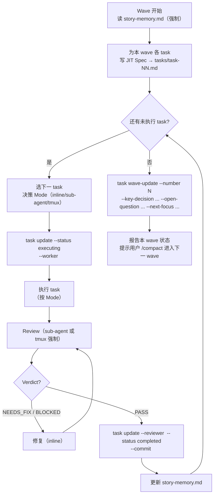

# Execution Protocol

任务执行协议，覆盖 SKILL.md Phase 4 中 wave loop 的所有细节。SKILL.md 给出三档 mode 的精简表，本文档给出每档的具体判定算法、prompt 结构、回环规则。

---

## Principles

1. **单一真相**：以 `<PROJECT_ROOT>/stories/<YYYY-MM-DD>-<slug>/` 下的文档作为 Story 的唯一事实源。文档内容必须真实反映用户需求、设计意图、任务状态。
2. **渐进式设计（JIT Spec）**：在每个 wave 开始前、基于最新上下文为本 wave 的 task 编写 Spec。spec 字段为 null 时 CLI 会拒绝 status=executing。
3. **持续改进**：在 `story-memory.md` 记录跨 task 可复用的经验/踩坑，下一 wave 开头读取。
4. **编码与评审分离**：编码任务在 inline / sub-agent / tmux 任一 mode 下执行，但 review 必须独立上下文（sub-agent 或 tmux）。**不得自评**。

---

## Mode 详细判定

SKILL.md `## Execution Mode` 定义了三档（Inline / Sub Agent / Tmux）。本节给出落地规则。

### 探索阈值的预判算法

阈值定义（**单一真相，其他段引用此处**）：**>5 文件 或 >2000 行**。

```
1. 任务里的"探索"开始前，先用 1-2 次 cheap grep / glob 估算命中文件数
2. 命中超过阈值 → 立即派 sub-agent 一次性返回结构化探索清单（文件 / 函数 / LOC 估算 / 关键调用链）
3. 命中未超阈值 → 继续 inline 读完
4. 边读边超过预算（已读文件数超过阈值）→ 停下，把"已读结论 + 待读清单"打包给 sub-agent 接力
```

### Inline 触发

默认所有任务走 Inline，除非命中 Sub Agent 或 Tmux 的明确触发条件。Inline 涵盖：

- 编写代码、单元/集成测试
- JIT Spec 撰写
- story.md / story-memory.md 撰写
- 探索阈值以下的探索（见上）
- 修复 review 反馈（reviewer 已隔离判定，修复回主上下文）
- CLI 状态更新、git commit

### Sub Agent 触发

派 sub-agent 当任务的产物是 verdict / 摘要、或会污染主上下文：

| 任务类型 | 派遣理由 |
|---|---|
| 项目代码探索超过阈值 | raw 内容污染主上下文 |
| 第三方库 / GitHub 开源项目调研 | 外部代码完全是噪音，主上下文只需结论 |
| 代码评审（默认） | 强制独立判断，避免自评偏差 |
| 复杂调试 / 失败分析（多次试错、长 log trace） | 调试过程中的 dead-end 是噪音 |
| E2E 测试失败诊断 | 跨组件 trace 噪音密集 |

#### 调试 sub-agent 的产物契约

调试 sub-agent **只返回根因**，不返回 patch：

```markdown
## ROOT CAUSE
<one paragraph: where it breaks, what condition triggers it>

## EVIDENCE
- <log line / test failure / file:line>
- <最小复现步骤>

## REPRODUCIBLE?  Y / N
```

修复回到主上下文，由 kickoff 自己决定改哪、怎么改。

### Tmux 触发

仅在以下情况：

- 当前 runtime 没有 native sub-agent 机制（你在 Codex / Pi / 非 Claude 环境）
- 当前 runtime 有 native sub-agent，但任务需要 **不同模型**（如你是 Claude 但要用 Codex 跑代码评审）
- 用户明确指定使用某 runtime

具体派遣命令、wait/collect、worktree 见 `commands.md`。

---

## Sub Agent Dispatch Prompt（最小契约）

派 sub-agent 时，**不附加额外 worker guideline**（信任项目 CLAUDE.md + task spec 的契约性）。Prompt 只包含：

```
<task spec verbatim：tasks/task-NN.md 的全部内容>

[可选] ## Story Memory（仅本任务相关的 Patterns / Gotchas / Known False Positives）

[可选] ## File Scope
<tasks[NN].files_modified 列出的文件，必要时贴出 ≤200 行的关键 snippet>

完成后请按以下格式回报：

## COMPLETION REPORT
- status: completed | needs-kickoff | blocked
- changes: <一句话总结改了哪些文件 / 加了哪些函数>
- deviations: <偏离 spec 的地方；无则写 none>
- next-task-hint: <若你发现下一 task 该带的 context，写一句话；无则写 none>
- story-memory-impact: <跨 task 可复用的 patterns / gotchas / known-false-positives 候选；无则写 none>
```

5 行 completion report 字段是 sub-agent 向你回流信息的唯一约束；其余信任 CLAUDE.md。

---

## Wave Workflow

### 执行规则

1. Execution 以 wave 为单位迭代。
2. 同一 wave 的 task 顺序执行（不并行），整个 wave 共享一个上下文窗口。
3. 单个 wave 内可混用 mode（task 1 inline、task 2 sub-agent、task 3 inline 等），按任务类型决策。
4. wave 结束后由用户手动 `/compact` 进入新会话；新会话从 `tasks.yaml` 的 `waves[]` 末项 + `story-memory.md` 续上。

### Wave 流程图



### 关键节点说明

- **A. 读 story-memory.md**：强制。跨 wave 上下文恢复的主入口，未读会出现重复踩坑。
- **B. JIT Spec**：必须用 `templates/task.md` 三段（Objective / Protocol / Acceptance Checklist），spec 字段写入后 CLI 才允许 executing。
- **D. Mode 决策**：依 `## Mode 详细判定` 表，按"上下文污染风险"判，不按规模。
- **G. Review**：永远独立上下文（sub-agent 默认 / tmux 备选）。详见 `review.md`。
- **K. story-memory.md**：本 task 发现的可跨 task 复用经验，去噪后追加。规则见 `story-memory-guideline.md`。
- **L. wave-update**：本 wave 收尾必做。`waves[]` 末项就是新会话续 wave 的入口。

---

## Context Management 三目标速查

| 目标 | 措施 | 时机 |
|---|---|---|
| 防 Story 目标漂移 | 重读 story.md + 当前 task.md | 开始新 task 时 |
| 防 Story 目标漂移 | 将状态落盘到 tasks.yaml | task 状态变化时 |
| 防上下文腐化 | sub-agent 接管探索 / 调研 | 触发探索阈值时 |
| 防上下文腐化 | sub-agent / tmux 执行 review | 每个 task 完成编码后 |
| 复用开发/测试经验 | 追加 story-memory.md | 每个 task 完成后 |
| 复用开发/测试经验 | 读 story-memory.md | wave 开始时 |
| 跨 wave 续接 | wave-update 写入 waves[] | wave 收尾时 |
| 跨 wave 续接 | 新会话读 waves[] 末项 | 用户 /compact 后再次进入 |
