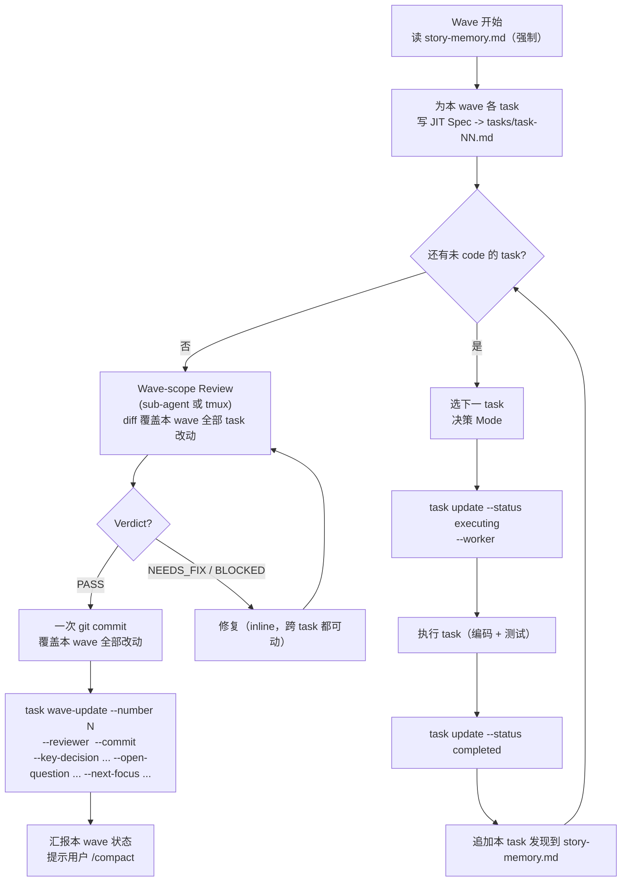

# Execution Protocol

Wave执行协议：负责落地规则、判定算法、prompt 契约和回环规范。

## Scope

本文定义四件事：

| 主题 | 内容 |
|---|---|
| 模式判定 | Inline / Sub Agent / Tmux 何时使用 |
| 探索阈值 | 何时把探索移交给 sub-agent |
| 派遣契约 | sub-agent prompt 和 completion report 的固定格式 |
| Wave loop | 从读 `story-memory.md` 到 `wave-update` 的完整闭环 |

## Principles

1. **单一真相**：`<PROJECT_ROOT>/stories/<YYYY-MM-DD>-<slug>/` 下的文档是 Story 唯一事实源。
2. **JIT Spec**：每个 wave 开头、基于最新上下文编写该 wave 的 task spec。
3. **持续改进**：跨 task 可复用的经验写入 `story-memory.md`。
4. **编码与评审分离**：编码可走任一 mode；review 必须独立上下文执行。

## Mode 详细判定

`SKILL.md` 给的是总览；这里给出可执行的判断规则。

### 探索阈值的预判算法

阈值定义：**>5 文件 或 >2000 行**。

执行顺序：

1. 开始探索前，先用 1-2 次 cheap grep / glob 估算命中文件数。
2. 命中超过阈值：
   派 sub-agent，一次性返回结构化探索结果（文件 / 函数 / LOC 估算 / 关键调用链）。
3. 命中未超过阈值：
   继续 inline 探索。
4. inline 过程中如果已读文件数后来超出阈值：
   立刻停下，把“已读结论 + 待读清单”交给 sub-agent 接力。

### Inline

默认 mode。除非明确命中 Sub Agent 或 Tmux 条件，否则走 Inline。

适用任务：
- 编写代码
- 编写单元 / 集成测试
- 撰写 JIT spec
- 更新 `story.md` / `story-memory.md`
- 阈值以下的探索
- 修复 review 反馈
- CLI 状态更新和 `git commit`

### Sub Agent

当产物主要是**结论**而不是原始过程，或原始材料会污染主上下文时，派 sub-agent。

| 任务类型 | 原因 |
|---|---|
| 超阈值项目探索 | 原始代码和调用链太噪 |
| 第三方库 / GitHub 项目调研 | 外部代码不该塞进主上下文 |
| 代码评审 | 强制隔离判断，避免自评偏差 |
| 复杂调试 / 失败分析 | dead-end、trace、日志会污染主上下文 |
| E2E 失败诊断 | 跨组件 trace 噪音密集 |

#### 调试 Sub Agent 的产物契约

调试 sub-agent 只返回**根因**，不返回 patch：

```markdown
## ROOT CAUSE
<one paragraph: where it breaks, what condition triggers it>

## EVIDENCE
- <log line / test failure / file:line>
- <最小复现步骤>

## REPRODUCIBLE?  Y / N
```

修复动作仍回到主上下文，由 orchestrator 决定怎么改。

### Tmux

仅在以下场景使用：

- 当前 runtime 没有 native sub-agent 机制
- 当前 runtime 虽然有 sub-agent，但需要切换到**不同 runtime / 模型**
- 用户明确要求某个 runtime

具体命令和 worktree 流程见 `commands.md`。

## Sub Agent Dispatch Prompt

不要额外拼接 worker guideline。信任项目级 `CLAUDE.md` 与 task spec。

派发 prompt 只包含：

```text
<tasks/task-NN.md 全文>

[可选] ## Story Memory
<仅与本任务相关的 Patterns / Gotchas / Known False Positives>

[可选] ## File Scope
<tasks[NN].files_modified 中必要的关键 snippet；总量 <= 200 行>

完成后请按以下格式回报：

## COMPLETION REPORT
- status: completed | needs-orchestrator | blocked
- changes: <一句话总结改了哪些文件 / 加了哪些函数>
- deviations: <偏离 spec 的地方；无则写 none>
- next-task-hint: <下一 task 需要继承的上下文；无则写 none>
- story-memory-impact: <可进入 story-memory 的候选；无则写 none>
```

这 5 个字段是回流信息的唯一硬约束。

## Wave Workflow

### 执行规则

1. 以 wave 为单位迭代。
2. 同一 wave 内 task 顺序执行，不并行。
3. 同一 wave 内允许混用 mode。
4. **review 与 commit 的粒度是 wave，不是 task**：本 wave 所有 task 都 code 完之后，做**一次** code review + **一次** git commit；`reviewer` 和 `commit` 字段写在 `waves[]` 末项，不写在 task 上。
5. wave 结束后由用户手动 `/compact`；下一会话从 `tasks.yaml` 的 `waves[]` 末项继续。

### 流程图



### 关键节点

| 节点 | 必做项 |
|---|---|
| A | 先读 `story-memory.md`，否则容易重复踩坑 |
| B | 用 `templates/task.md` 写 `Objective / Protocol / Acceptance Checklist`；`spec` 写回 `tasks.yaml` |
| D | 按"上下文污染风险"判 mode，不按任务大小拍脑袋 |
| G | "completed" 在 kickoff skill 里表示"已 code 并自检通过"，不包含 review/commit |
| H | 只追加去噪后的跨 task 经验；规则见 `story-memory-guideline.md` |
| R | wave 末一次性 review：diff 覆盖本 wave 全部 task 的 `files_modified`；细节见 `review.md` |
| X | 修复在主上下文做，可以跨 task 改；修复完回到 R 再 review 一轮 |
| Y | 整个 wave 一个 commit；commit message 概括 wave 目标，body 可列出本 wave 包含的 task id |
| L | `wave-update` 把 `reviewer` + `commit` + `key_decisions` 等写入 `waves[]` 末项；它是下一会话的入口 |

## Context Management 速查

| 目标 | 措施 | 时机 |
|---|---|---|
| 防 Story 目标漂移 | 重读 `story.md` 和当前 `task.md` | 开始新 task 时 |
| 防 Story 目标漂移 | 把状态写回 `tasks.yaml` | task 状态变化时 |
| 防上下文腐化 | sub-agent 接管探索 / 调研 | 触发探索阈值时 |
| 防上下文腐化 | sub-agent / tmux 执行 review | 每个 task 编码完成后 |
| 复用经验 | 追加 `story-memory.md` | 每个 task 完成后 |
| 复用经验 | 读取 `story-memory.md` | 每个 wave 开始时 |
| 跨 wave 续接 | `wave-update` 写入 `waves[]` | 每个 wave 收尾时 |
| 跨 wave 续接 | 读取 `waves[]` 末项 | `/compact` 后重新进入时 |
