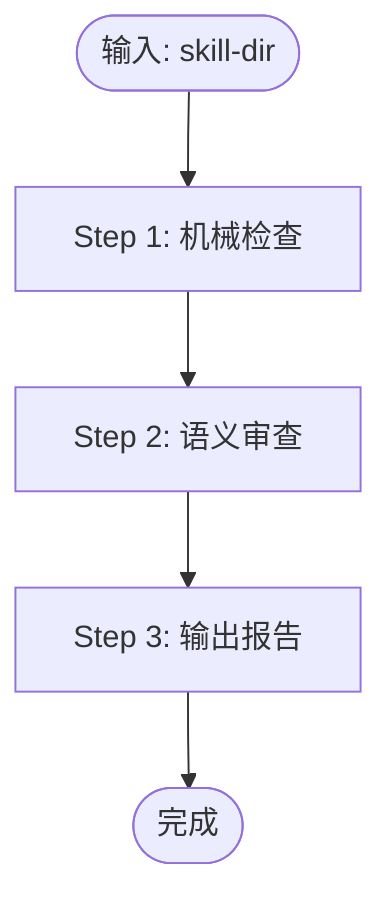

# Skill Review

Purpose: 审查 skill 目录，发现 spec 违规、设计缺陷和证据质量问题。
Input:   Skill 目录路径（用户提供）。
Output:  按 `assets/review-result-template.md` 格式输出的审查报告。
Scope:   审查对象 = `SKILL.md` + `references/**/*.md` + `scripts/*` + `assets/**`。references 会在运行时被 agent 增量加载，其内容等同 SKILL.md 的延伸指令，必须同步审查。

## 前置检查

如果用户未提供路径，询问：
> 请提供要审查的 skill 目录路径，例如：`skills/my-skill`

确认 `SKILL.md` 存在。不存在则停止并报告。

## 工作流



### Step 1：机械检查

```
omp skill-review --skill-dir <path>
```

将脚本输出全部纳入报告。不重新发明机械检查逻辑。

### Step 2：语义审查

加载 `references/rubric.md`。
按其 13 个维度逐一检查，每个维度必须得出结论（PASS / FINDING / N/A）。
每条 finding 必须标注 `source_file`（SKILL.md / references/X.md / scripts/Y）。

按需加载（发现 FINDING 时）：

| 维度 | 加载文件 |
|------|---------|
| B1 | `references/how-to-optimize-skill-descriptions.md` |
| B2 / B3 | `references/agent-skills-best-practices.md` |
| B5 | `references/how-to-use-scripts-in-skills.md` |

### Step 3：输出报告

加载 `assets/review-result-template.md`，严格按模板填写。
不得省略汇总表的任何一行。

## 失败处理

- `omp skill-review` 执行失败 → 报告错误原文，跳过 Step 1，继续 Step 2，报告中注明机械检查未完成
- `references/rubric.md` 无法读取 → 停止并报告，不继续
- `assets/review-result-template.md` 无法读取 → 按 Output Format 节描述的格式输出

## Guardrails

- 禁止无证据的 finding：每条 finding 必须引用文件原文、文件状态或脚本输出
- 禁止把项目偏好标记为 SPEC 违规，标签必须准确
- 禁止把多个独立问题合并为一条 finding
- 禁止因维度"看起来没问题"而跳过——每个维度必须有明确结论
- 禁止重新发明 A3 机械检查——直接使用脚本输出
