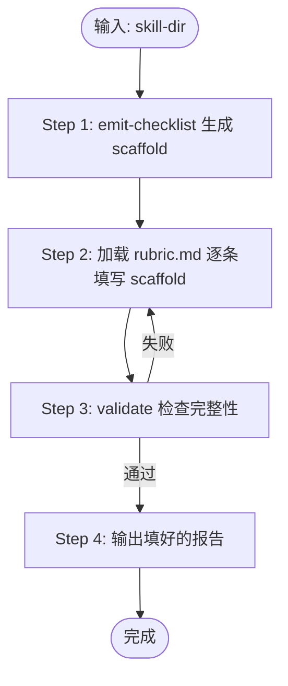

# Skill Review

Purpose: 审查 skill 目录，发现 spec 违规、设计缺陷和证据质量问题。
Input:   Skill 目录路径（用户提供）。
Output:  填好的 scaffold Markdown 文件（路径由 emit-checklist 生成）。
Scope:   `SKILL.md` + `references/**/*.md` + `scripts/*` + `assets/**`。references 在运行时被 agent 增量加载，等同 SKILL.md 的延伸指令，必须同步审查。

## 前置检查

如果用户未提供路径，询问：
> 请提供要审查的 skill 目录路径，例如：`skills/my-skill`

确认 `SKILL.md` 存在。不存在则停止并报告。

## 工作流



### Step 1：生成 scaffold

```
omp skill-review emit-checklist --skill-dir <path> --output /tmp/review-<skill>.md
```

scaffold 包含：审查头信息、机械检查 JSON、按 13 个维度展开的 checklist。每条 checkbox 默认 `[ ]` 加 `__STATE__` / `__EVIDENCE__` 占位符。

不重新发明机械检查，不跳过此步。

### Step 2：填写 scaffold

加载 `references/rubric.md`，对照 scaffold 的每条 checkbox 逐一填写：

- **状态**：`[✓]` 通过 / `[✗]` 违规 / `[—]` 不适用
- **证据**：替换 `__EVIDENCE__`，引用文件原文、机械检查 JSON 字段或文件状态
- **维度判定**：替换章节标题里的 `__STATE__` 为 `PASS` / `FINDING` / `N/A`
- **`[✗]` 行展开**：必须紧跟 4 个子项
  - **标签**：SPEC / BEST_PRACTICE / PROJECT_POLICY（可多选）
  - **影响**：一句话说明对执行、触发或输出的影响
  - **修复**：具体替换文本或操作步骤
  - **验证**：复跑命令或检查文件状态

按需加载（发现 FINDING 时）：

| 维度 | 加载文件 |
|------|---------|
| B1   | `references/how-to-optimize-skill-descriptions.md` |
| B2 / B3 | `references/agent-skills-best-practices.md` |
| B5   | `references/how-to-use-scripts-in-skills.md` |

### Step 3：验证完整性

```
omp skill-review validate /tmp/review-<skill>.md
```

退出非零 → 按报错行号补全 → 重跑直到退出 0。

### Step 4：输出报告

填好的 scaffold 文件即最终报告。把内容直接交付。

## 失败处理

- `omp skill-review emit-checklist` 失败 → 报告错误原文并停止
- `references/rubric.md` 无法读取 → 停止并报告
- `omp skill-review validate` 失败 → 回到 Step 2 补全，不得跳过

## Guardrails

- 禁止跳过 `emit-checklist` 或 `validate` 任一步
- 禁止以维度级别 `PASS` 替代逐条 checkbox 填写
- 禁止保留 `[ ]`、`__STATE__`、`__EVIDENCE__`、`{{...}}` 占位符
- 禁止无证据的 finding：每条 finding 必须引用文件原文、文件状态或机械检查 JSON
- 禁止把项目偏好标记为 SPEC 违规，标签必须准确
- 禁止把多个独立问题合并为一条 finding
